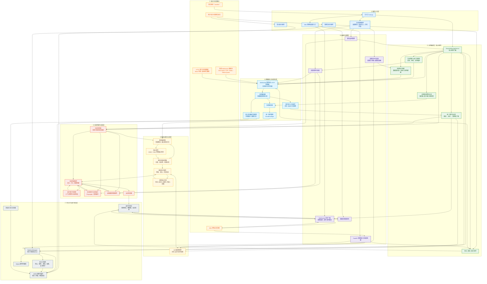

<!-- markdownlint-disable MD033 -->
<!-- markdownlint-disable MD041 -->


<p align="center">
  
  
  
</p>

<p align="center">
  
  
  
</p>

<p align="center">
  
  
  
</p>

<p align="center">
  <a href="https://deepwiki.com/DBJD-CR/astrbot_plugin_disaster_warning" target="_blank"></a>
  <a href="https://zread.ai/DBJD-CR/astrbot_plugin_disaster_warning" target="_blank"></a>

[](https://github.com/DBJD-CR/astrbot_plugin_disaster_warning)


---

  一个为 [AstrBot](https://github.com/AstrBotDevs/AstrBot) 设计的，功能强大的多数据源灾害预警插件，它能让你的 Bot 提供实时的地震、海啸、气象预警信息推送服务。

## 📑 快速导航

<div align="center">

| 左列 | 右列 |
| :--- | :--- |
| 1. [✨ 功能特性](#-功能特性) | 12. [📒 增强的可读性日志格式](#-增强的可读性日志格式) |
| 2. [🚀 安装与使用](#-安装与使用) | 13. [❓ 常见问题简答](#-常见问题简答) |
| 3. [📊 推送示例](#-推送示例) | 14. [🚧 最新版本的已知限制](#-最新版本的已知限制) |
| 4. [🖼️ 图片渲染功能](#image-render) | 15. [🤝 贡献与支持](#-贡献与支持) |
| 5. [💻 现代化 WebUI 控制台](#-现代化-webui-控制台) | 16. [📢 免责声明](#-免责声明) |
| 6. [📡 数据源状态](#-数据源状态) | 17. [📄 许可证](#-许可证) |
| 7. [📑 插件配置项详解](#-插件配置项详解) | 18. [🙏 致谢](#-致谢) |
| 8. [📋 使用命令](#-使用命令) | 19. [📚 推荐阅读](#-推荐阅读) |
| 9. [📂 插件目录与结构](#-插件目录与结构) | 20. [📊 仓库状态](#-仓库状态) |
| 10. [🏗️ 系统架构](#system-architecture) | 21. [⭐️ 星星](#️-星星) |
| 11. [📈 性能报告](#-性能报告) | |

</div>

---

<!-- 开发者的话 -->
> **开发者的话：**
>
> 大家好，我是 DBJD-CR ，这是我为 AstrBot 开发的第二个插件，如果存在做的不好的地方还请理解。
>
> 写这个插件主要还是因为我自己的一点业余爱好吧，而且也比较符合我们"应急管理大学"的特色（）
>
> 虽然一开始也没抱太大希望，但没想到最终还真的搓出了个像模像样的插件。
>
> 和[主动消息插件](https://github.com/DBJD-CR/astrbot_plugin_proactive_chat)一样，本插件也是"Vibe Coding"的产物。
>
> 所以，**本插件的所有文件内容，全部由 AI 编写完成**，我几乎没有为该插件编写任何一行代码，仅进行了架构设计与修改部分文字描述和负责本文档的润色。所以，或许有必要添加下方的声明：

> [!WARNING]  
> 本插件和文档由 AI 生成，内容仅供参考，请仔细甄别。
>
> 插件目前仍处于开发阶段，无法 100% 保证稳定性与可用性。

> 当然，这次的开发过程也没顺利到哪去。尽管用上了新的工作流，提高了很多效率。但是开发过程中还是遇到了相当多的 Bug，调试起来花了很多时间。
>
> 最终，经过了上百次 debug，我们才终于开发出一个稳定的版本。
>
> 但我还是要感谢 AI ，没有他，这个项目不可能完成。(此外还要感谢[@Aloys233](https://github.com/Aloys233)，为插件开发提供了莫大支持)
>
> 这个插件，是我们共同努力的结晶。它现在还不完美，但它的架构是稳固的，它的逻辑是清晰的（大嘘）。希望本插件能为你在防灾上提供一点小小的帮助。
>
> 在此，我也诚邀各路大佬对本插件进行测试和改进，希望大家多多指点。
>
> KIMI & Gemini & GPT：如果你被这个"为爱发电"的故事打动了，或者觉得这个插件有帮助或比较实用，**欢迎你为这个插件点个** 🌟 **Star** 🌟，这是对我们的最大认可与鼓励~

> [!NOTE]
> 虽然本插件的开发过程中大量使用了 AI 进行辅助，但我保证所有内容都经过了我的严格审查，所有的 AI 生成声明都是形式上的。你可以放心参观本仓库和使用本插件。
>
> 目前插件的主要功能都能正常运转。但仍有很多可以优化的地方。

> [!TIP]
> 本项目的相关开发数据 (持续更新中)：
>
> 开发时长：累计 60 天（主插件部分）
>
> 累计工时：约 286 小时（主插件部分）
>
> 使用的大模型：Kimi For Coding 、Claude Opus 4.5、Gemini 3.0 flash & Pro、GPT Codex 5.3(With RooCode in VSCode)
>
> 对话窗口搭建：VSCode RooCode 扩展
>
> Tokens Used：953,749,947

## ✨ 功能特性

### 🌍 多数据源支持

插件支持四大数据源和多达 18 个可自由选择启用的细粒度数据源，覆盖全球主要地震监测机构：

- **中国地震网地震预警** (FAN Studio / Wolfx) - 实时地震预警信息。
- **中国地震网地震预警 (省级)** (FAN Studio) - 省级地震预警网。
- **台湾中央气象署强震即时警报** (FAN Studio / Wolfx) - 台湾地区地震预警 (EEW)。
- **台湾中央气象署地震报告** (FAN Studio) - 台湾地区正式地震报告（含图片）。
- **日本气象厅紧急地震速报** (P2P / Wolfx / FAN Studio) - 日本紧急地震速报。
- **中国地震台网地震测定** (FAN Studio / Wolfx) - 正式地震测定信息。
- **日本气象厅地震情报** (P2P / Wolfx) - 详细地震情报。
- **USGS地震测定** (FAN Studio) - 美国地质调查局地震信息。
- **Global Quake服务器** - 全球地震测站实时计算推送，精度有限。
- **中国气象局气象预警** (FAN Studio) - 气象灾害预警。
- **自然资源部海啸预警中心** (FAN Studio) - 海啸预警信息。
- **日本气象厅海啸预报** (P2P) - 日本海啸预报信息。

### 🔁 事件去重功能

插件具备基础的事件去重功能，并优先基于事件 ID 进行去重。此外在缺少事件 ID 的情况下，也有一套基础去重规则，防止同一地震事件被同一个数据源重复推送。

**基础去重规则**：

- **时间窗口**：1 分钟内接收到的相似事件（无报数更新信息等）视为同一事件。
- **位置容差**：经纬度差异在 20 公里内视为同一事件。
- **震级容差**：震级差异在 0.5 级内视为同一事件。

### 📱 灵活配置

- **WebUI配置**
  - 支持通过 AstrBot 原生 WebUI 界面进行配置，配备了新潮的滑块组件。
  - 还支持通过插件自带的 WebUI 进行更高效的配置管理与状态监控。**进行会话个性化配置请前往此处**。
- **自定义推送** - 支持多平台/多实例/个性化，配置特定私聊/群聊接收预警（留空则不推送）。
- **专门格式化** - 针对不同数据源的信息进行专门格式化，确保了良好的信息展示。

## 🚀 安装与使用

1. **下载插件**: 通过 AstrBot 的插件市场下载。或从本 GitHub 仓库的 Release 下载 `astrbot_plugin_disaster_warning` 的 `.zip` 文件，在 AstrBot WebUI 中的插件页面中选择 `从文件安装` 。
2. **安装依赖**: 本插件的核心依赖大多已包含在 AstrBot 的默认依赖中，且在插件下载安装时会自动安装插件所需的依赖，通常无需额外安装。如果你的环境中确实缺少相关依赖，请安装：

   ```bash
   pip install python-dateutil asyncio-mqtt jinja2 playwright tzdata fastapi uvicorn protobuf
   # Python < 3.11 额外安装
   pip install "tomli>=2.0.1; python_version < '3.11'"
   ```

3. **重启 AstrBot (可选)**: 如果插件没有正常加载或生效，可以尝试重启你的 AstrBot 程序。
4. **配置插件**: 进入 AstrBot WebUI，找到 `灾害预警` 插件，选择 `插件配置` 选项，配置相关参数。或者在插件自带的 WebUI 中进行配置。

## 📊 推送示例

以下是插件中部分数据源的文字推送示例。

### 地震预警推送示例

**中国地震预警网示例**：

```text
🚨[地震预警] 中国地震预警网
📋第 1 报
⏰发震时间：2026年01月09日 01时00分02秒 (UTC+8)
📍震中：新疆喀什地区塔什库尔干县 (37.79°N, 75.06°E)
📊震级：M 4.4
🏔️深度：15 km
💥预估最大烈度：5.6 🟡

📍本地预估：
距离震中 3588.8 km，预估最大烈度 0.0 (⚪ 无感)
🗺️地图瓦片:[Image]
```

**日本气象厅紧急地震速报示例**：

```text
🚨[紧急地震速报] [予報] 日本气象厅
📋第 4 报(最终报)
⏰发震时间：2026年01月09日 00时29分06秒 (UTC+8)
📍震中：福島県沖 (37.40°N, 142.30°E)
📊震级：M 4.2
🏔️深度：60 km
💥预估最大震度：2.0 🔵

📍本地预估：
距离震中 2223.7 km，预估最大烈度 0.0 (⚪ 无感)
🗺️地图瓦片:[Image]
```

**Global Quake 地震预警示例**：

```text
🚨[地震预警] Global Quake
📋第 9 报
⏰发震时间：2026年01月09日 00时59分59秒 (UTC+8)
📍震中：塔吉克斯坦、中国新疆边境地区附近 (37.33°N, 74.60°E)
📊震级：M 5.4
🏔️深度：35.2 km
💥预估最大烈度：5.0 🟢
📈最大加速度：16.9 gal
📡触发测站：62/69
🗺️地图瓦片:[Image]
```

**中国地震台网地震测定示例**：

```text
🚨[地震情报] 中国地震台网 [正式测定]
⏰发震时间：2026年01月29日 21时54分28秒 (UTC+8)
📍震中：新疆巴音郭楞州轮台县 (41.40°N, 84.46°E)
📊震级：M 3.0
🏔️深度：15.0 km
💥最大烈度：4.0 🟦
🗺️地图瓦片:[Image]
```

**日本气象厅地震情报推送示例 (开启详细震度)**：

```text
🚨[各地震度相关情报] 日本气象厅
⏰发震时间：2026年01月09日 00时36分00秒 (UTC+8)
📍震中：島根県東部 (35.30°N, 133.30°E)
📊震级：M 3.4
🏔️深度：10.0 km
💥最大震度：2.0 🟦
🌊津波：无需担心海啸
📡各地震度详情：
  🟦[震度2] 鳥取南部町天萬、日南町生山
  ⬜[震度1] 鳥取南部町法勝寺、米子市東町、境港市東本町、伯耆町溝口、鳥取日野町根雨、江府町上之段広場、松江市東出雲町揖屋、安来市広瀬町広瀬祖父谷丁、安来市伯太町東母里、安来市安来町、雲南市大東町大東、奥出雲町三成、庄原市東城町
🗺️地图瓦片:[Image]
```

### 海啸预警推送示例 (仅供参考)

**中国海啸预警示例**：

```text
🌊[海啸预警]
📋海啸黄色警报
⚠️级别：黄色
🏢发布：自然资源部海啸预警中心
⏰发布时间：2025年07月15日 23时30分15秒 (UTC+8)
🌍震源：台湾花莲东部海域
📍台湾花莲 [黄色] 预计23:45到达 波高50-100cm
📍台东成功 [黄色] 预计00:15到达 波高30-80cm
  ...等5个预报区域
🔄事件编号：TS2025071501
```

**日本气象厅津波予報示例 (P2P)**：

```text
🌊[津波予報] 日本气象厅
📋津波注意報
⚠️級別：津波注意報
🏢発表：日本气象厅
⏰発表時刻：2025年12月04日 18时10分00秒 (UTC+9)
📍津波予報区域：
  • 北海道太平洋沿岸中部 (预计18:30到达) 🌊1m
  • 北海道太平洋沿岸东部 (预计18:40到达) 🌊0.5m
🔄事件ID：552
```

### 气象预警推送示例

```text
🍃[气象预警]
📋云南省昆明市东川区发布大风蓝色预警🔵
🏷️副标题：东川区气象台发布大风蓝色预警[Ⅳ级/一般]
📝东川区气象台2026年2月27日16时34分发布大风蓝色预警信号：预计未来12小时我区铜都街道、碧谷街道、阿旺镇、乌龙镇、汤丹镇、红土地镇、拖布卡镇、因民镇将出现8级以上大风，请注意防范。
⏰生效时间：2026年02月27日 16时39分00秒 (UTC+8)
⚠️预警图标:[Image]
```

## <span id="image-render">🖼️ 图片渲染功能</span>

插件引入了基于 Playwright 的高性能图片渲染引擎，能够将枯燥的纯文本预警数据转化为极具视觉冲击力的可视化卡片。这不仅提升了信息的可读性，更让您的 Bot 显得专业且富有科技感。

### 🎨 效果展示

#### 1. Global Quake 预警卡片

目前 `Global Quake` 数据源有两种精美的主题模板可供选择，提供极致的可视化预警体验。


> 极光主题 (Aurora)

---


> 暗夜主题 (DarkNight)

#### 2. 通用地图瓦片 (Base Map)

现在，所有地震消息都可以附带一张**实时的地图位置卡片**。该功能基于 Leaflet.js 构建，支持多种地图源（如 PetalMaps, OSM 等），为每一条预警提供直观的地理参考。


> 效果参考图 (PetalMap 矢量图 亮)

#### 3. 地震列表查询卡片 (List Card)

使用 `/地震列表查询` 命令时，插件可以生成精美的，仿 `JQuake` 风格的历史地震列表卡片，一次性直观展示最近发生的多次地震事件及其震级、烈度/震度分布。


> 使用指令 /地震列表查询 cenc 9 生成

---


> 使用指令 /地震列表查询 jma 9 生成

### ✨ 核心特性

插件的图片渲染引擎是一个动态的、数据驱动的前端生成系统：

- **动态绘图与可视化**:基于 `Leaflet.js` 动态加载瓦片地图，支持自适应缩放。
- **自适应视觉语言**: 背景色调与视觉元素会根据烈度等级（MMI / 气象厅震度）自动切换，让危险等级一目了然。
- **高清矢量渲染**: 采用高倍率设备像素比 (Device Scale Factor) 进行渲染，确保输出图片在手机高分屏上依然清晰锐利。
- **跨平台兼容性增强**:
  - **Base64 传输**: 渲染生成的图片直接转换为 Base64 编码发送，彻底解决了 Windows 环境下 `file://` 协议的路径兼容性问题。
  - **浏览器池预热**: 插件启动时会自动预热无头浏览器实例，确保第一条预警下发时的渲染速度，显著降低首推延迟。

### ⚠️ 注意事项与系统要求

虽然图片渲染功能非常酷炫，但它也对运行环境提出了一定要求：

- **内存消耗 (Memory Usage)**:
  - 开启此功能会启动 Headless Chromium 浏览器实例。
  - 每次渲染任务大约需要消耗 **200MB - 500MB** 的瞬时内存。
  - **警告**: 如果您的服务器内存小于 1GB（或未配置 Swap），**建议不要开启此功能**，否则可能导致 Bot 进程因 OOM (Out Of Memory) 被系统杀掉。

- **环境依赖 (Dependencies)**:
  - 插件依赖 `playwright` 库来驱动浏览器。
  - 在 Windows 上通常可以直接使用。
  - 在 **Linux** 环境（尤其是 Docker 或最小化安装的系统）中，可能缺少浏览器运行所需的系统级依赖库（如 libgtk 等）。
  - 若遇到报错，请尝试在终端执行以下命令安装依赖：

    ```bash
    playwright install --with-deps chromium
    ```

  - **远程方案**：使用 **远程 Playwright** 避免在容器内安装浏览器。例如在配置中设置：

    ```json
    {
      "playwright_mode": "remote",
      "playwright_server_url": "ws://192.168.1.100:3000"
    }
    ```

    然后在宿主机或其他服务器上运行：`npx playwright run-server --port 3000 --host 0.0.0.0`

- **存储空间 (Storage)**：
  - 生成的图片文件会临时存储在插件的数据目录下的 `temp` 文件夹中。
  - **极光主题 (Aurora)**：单张图片约 **600KB**。
  - **暗夜主题 (DarkNight)**：单张图片约 **500KB**。
  - **地震列表图片**：单张图片约 **100KB**。
  - **地图瓦片**：单张图片约 **800KB**。
  - 插件内置了自动清理机制，会每隔 **24 小时** 自动清理 **3 小时前** 生成的图片，且如果文件过多也会自动提前清理，无需担心占用过多磁盘空间，但仍建议预留 200MB 左右的空间。

- **渲染延迟 (Latency)**:
  - 生成一张高清卡片通常需要 **0.5-7 秒** 的时间。
  - **异步分离发送**: 针对 CEA、JMA、CWA 的地震预警（EEW），插件会自动将文本消息与地图瓦片**分离发送**。文本消息将毫秒级秒发，而地图图片在后台渲染完成后自动补发，确保预警时效性不受渲染耗时影响。
  - **智能报数控制**: 为了优化性能，EEW 地图图片仅在 **第 1...5...10...以及最终报** 时触发渲染，避免在高频更新时造成不必要的资源开销。
  - **坐标自动校验**: 插件会自动检查上游数据的经纬度有效性，若出现无效坐标将自动跳过渲染，确保系统鲁棒性。

- **字体问题 (Fonts)**:
  - 渲染器默认使用宿主系统的字体。
  - 如果您的 Linux 服务器出现中文显示为“方框”或乱码，请安装开源中文字体（如 `fonts-noto-cjk` 或 `wqy-zenhei`）。

## 💻 现代化 WebUI 控制台

从 v1.4.0 版本开始，插件引入了全新的、功能完备的 WebUI 管理端。它不仅仅是一个配置页面，更是一个集“可观测、可操作、可回溯、可配置”于一体的现代化控制台。


### ✨ 核心亮点

- **四大核心视图**：
  - **📊 运行状态**：一屏掌握服务健康度。包含实时动态跑马灯、连接矩阵（展示各数据源在线状态、延迟与重试次数）、快捷运维操作（一键重连、清除统计、模拟预警），地震预警状态等。
  - **🔔 事件列表**：强大的事件回溯能力。支持按类型、震级、数据源多维筛选；支持气象预警快捷查询；同一事件多报次自动折叠聚合，清晰展示事件演进轨迹；内置重大事件横向时间轴，支持拖拽、长按浏览和数据筛选。
  - **📈 数据统计**：直观的数据分析。提供震级分布图、趋势图、日历热力图、地区与数据源贡献榜单，让灾害数据一目了然。
  - **⚙️ 配置管理**：基于 Schema 的动态表单。支持全局配置与**会话差异配置**，提供分组折叠、草稿自动保存、一键恢复等高级功能。

- **极致的交互体验**：
  - **🎨 MD3 视觉体系**：采用 Material Design 3 规范，结合磨砂玻璃态设计，提供亮色/暗色主题无缝切换。
  - **⚡ 实时数据流**：基于 WebSocket 全局单例连接，实现状态与事件的毫秒级实时推送，告别手动刷新。
  - **📱 全端适配**：响应式布局完美覆盖桌面、平板与移动端，随时随地掏出手机即可进行运维管理。
  - **🧠 状态记忆**：智能记忆您的滚动位置、主题偏好与配置草稿，提供丝滑连贯的操作体验。

## 📡 数据源状态

| 数据源 | 提供者 | 类型 | 状态 |
| :--- | :--- | :--- | :--- |
| 中国地震预警网 (含省级) | FAN Studio | EEW | ✅ |
| 中国地震预警网 | Wolfx | EEW | ✅ |
| 台湾中央气象署 | FAN Studio | EEW | ✅ |
| 台湾中央气象署 | FAN Studio | Info | ✅ |
| 台湾中央气象署 | Wolfx | EEW | ✅ |
| 日本气象厅紧急地震速报 | P2P | EEW | ✅ |
| 日本气象厅紧急地震速报 | Wolfx | EEW | ✅ |
| 日本气象厅紧急地震速报 | FAN Studio | EEW | ✅ |
| Global Quake | Global Quake | EEW | ✅ |
| 中国地震台网 | FAN Studio | Info | ✅ |
| 中国地震台网 | Wolfx | Info | ✅ |
| 日本气象厅地震情报 | P2P | Info | ✅ |
| 日本气象厅地震情报 | Wolfx | Info | ✅ |
| 美国地质调查局 | FAN Studio | Info | ✅ |
| 中国气象局 | FAN Studio | Weather | ✅ |
| 中国海啸预警中心 | FAN Studio | Tsunami | ✅ |
| 日本气象厅海啸预报 | P2P | Tsunami | 🧪 |

✅ **正常**  
⚠️ **不稳定**  
❌ **完全不可用**  
🚧 **维护中**  
🧪 **测试中**  

### ⏰ 数据延迟

根据不同数据源，以及 API 服务的收发耗时，接收到的数据再经插件处理后可能会产生一定的推送延迟：

- **中国地震预警网 (CEA)**：约 0.5-2s
- **台湾中央气象署 (CWA)**：首报推送延迟约 2-5s ，少数情况可达 10 秒以上，后续约 0.5s-2s ，启用融合策略可能增加 3-5s 不等
- **日本气象厅紧急地震速报 (JMA)**：约 0.5-2s
- **Global Quake 地震预警**：首报推送最快约 15-60s ，部分情况可达 3-5 分钟以上，后续约 0.5s-15s
- **中国地震台网地震测定 (CENC)**：约 0.5-2s，启用融合策略可能增加 2-10s 不等
- **台湾中央气象署地震报告 (CWA)**：约 0.5-2s
- **日本气象厅地震情报 (JMA)**：约 0.5-2s
- **美国地质调查局地震测定 (USGS)**：约 0.5-15s
- **中国气象局气象预警 (CMA)**：约 3-15 分钟
  - 开启地图瓦片渲染 / GQ 卡片还将额外增加约 1-2.5s 的延迟。(地图瓦片仅影响地震情报延迟，不阻塞地震预警类事件的推送)
  - 不同数据源间的**推送**延迟一般为 Fan = P2P ＜ Wolfx ＜ Global Quake

## 📑 插件配置项详解

> 本插件在 AstrBot 与插件自带的 WebUI 中提供了详尽的配置项，采用了分层级、模块化的设计，旨在让用户能针对全球不同地区的灾害信息进行极致的个性化定制。
>
> 在插件自带的 WebUI 中，您可以进行会话的差异覆写以实现精细化配置。

<details>
<summary>点击查看配置项详解</summary>

### ⚙️ 1. 基础全局配置 (General)

控制插件的核心运行逻辑和基础通信参数。

- **启用插件 (`enabled`)**:
  - 类型：`Boolean`
  - 说明：插件的总开关。关闭此项后，插件将不会初始化任何处理器，所有与外部数据源的 WebSocket 连接将保持关闭状态，从而最大限度节省系统资源。

- **插件管理员列表 (`admin_users`)**:
  - 类型：`List[string]`
  - 说明：配置拥有插件管理权限的用户ID（QQ号等）。
  - 提示：
    - 插件在首次加载时会自动尝试将 AstrBot 全局管理员同步到此列表。
    - 拥有管理员权限的用户可以执行查看日志、清除统计、修改配置等敏感操作。
    - AstrBot 的全局管理员默认拥有插件管理权限，无需在此重复添加。

- **推送会话列表 (`target_sessions`)**:
  - 类型：`List[string]`
  - 说明：指定接收消息的会话 UMO。
  - 提示：格式为 `{platform_name}:{message_type}:{session_id}`。可通过 `/sid` 指令快捷获取当前会话的完整 UMO。支持多会话并行推送。

- **离线通知接收会话列表 (`offline_notification_sessions`)**:
  - 类型：`List[string]`
  - 说明：专门用于接收“数据源进入兜底重试/停止重连”的系统提示。
  - 提示：
    - 建议单独配置一个运维群，避免业务群被运维通知打扰。
    - 留空时会自动回退到 `target_sessions`。

- **默认显示时区 (`display_timezone`)**:
  - 类型：`String`
  - 默认值：`UTC+8`
  - 说明：所有灾害预警消息中时间显示的默认时区。支持 `UTC+8`, `Asia/Shanghai` 等格式。

```json
{
  "enabled": true,                // 启用或禁用插件
  "target_sessions": ["aiocqhttp:GroupMessage:123456789"],   // 推送目标会话列表
  "offline_notification_sessions": ["aiocqhttp:GroupMessage:987654321"], // 离线通知接收会话列表
  "display_timezone": "UTC+8"     // 自定义时区显示
}
```

---

### 📡 2. 多源数据流配置 (`data_sources`)

这是插件的核心，决定了您能接收到哪些来源的预警信息。建议根据地理位置和网络稳定性进行选择。

#### 🔹 FAN Studio WebSocket (推荐)

插件中目前最全面、最稳定的综合灾害数据流。

- **启用 (`enabled`)**: 开启后将订阅来自 FAN Studio 的实时推送。
- **中国地震预警网 (`china_earthquake_warning`)**: 接入国内地震预警系统（国家级），通常能在地震横波到达前数秒至数十秒下发预警。
- **中国地震预警网（省级）(`china_earthquake_warning_provincial`)**: FAN Studio 提供的省级地震预警通道，预警推送阈值比国家级更低，如果追求高覆盖率只开启省级预警网即可（同时避免重复推送）。
- **台湾中央气象署预警 (`taiwan_cwa_earthquake`)**: 针对台湾地区的强震即时警报 (EEW)，速度快但精度略低。
- **台湾中央气象署报告 (`taiwan_cwa_report`)**: 台湾地区的正式地震报告，包含震中图、等震度图等详细信息。
- **中国地震台网 (`china_cenc_earthquake`)**: 接收地震测定正式报，信息包含确切的发震时间、经纬度、深度和震级。
- **日本气象厅 EEW (`japan_jma_eew`)**: 通过 FAN Studio 链路获取的日本紧急地震速报，通常具备较低的跨境延迟。
- **USGS 地震测定 (`usgs_earthquake`)**: 接入美国地质调查局全球测定数据。
- **中国气象预警 (`china_weather_alarm`)**: 实时同步中国气象局下发的各类别、各等级气象灾害预警。
- **自然资源部海啸预警 (`china_tsunami`)**: 接收权威的海啸预报和警报。

#### 🔹 P2P地震情報 WebSocket

日本本土最为流行的互助式地震监测网络，对日本地震有极高的敏感度。

- **启用 (`enabled`)**: 建立到 p2pquake.net 的 WebSocket 长连接。
- **緊急地震速報 (`japan_jma_eew`)**: 对应 P2P 代码 556，提供**警报**级 EEW 的预估震度和波及范围。注意：此源不接收“予报”级信息。
- **地震情報 (`japan_jma_earthquake`)**: 对应 P2P 代码 551，地震发生后的详细震度分布报告。
- **津波予報 (`japan_jma_tsunami`)**: 对应 P2P 代码 552。

#### 🔹 Wolfx API (备份)

优秀的第三方多源集成 API。

- **启用 (`enabled`)**: 开启后将定期轮询 Wolfx API。
- **日本气象厅紧急地震速报 (`japan_jma_eew`)**: 接收 JMA 预警。
- **中国地震台网地震预警 (`china_cenc_eew`)**: 接收 CENC 预警。
- **台湾中央气象署地震预警 (`taiwan_cwa_eew`)**: 接收 CWA 预警。
- **日本气象厅地震情报 (`japan_jma_earthquake`)**: 接收 JMA 地震列表。
- **中国地震台网地震测定 (`china_cenc_earthquake`)**: 接收 CENC 地震列表。

#### 🔹 Global Quake (实时测算)

- **原理**: 连接到 Global Quake 服务器。这些数据是由全球数千个测站通过算法实时计算得出的。
- **特点**: 在偏远地区或国际海域，由于官方机构反应时间较长，GQ 往往能最先提供初步数据，但震级和位置可能随报数更新而有较大波动。

---

### 📍 3. 本地预估烈度 (`local_monitoring`)

该模块是插件的特色功能，它将全球地震事件与您的具体位置相结合。

- **启用本地监控 (`enabled`)**: 是否开启基于坐标的计算逻辑。
- **本地经纬度 (`latitude`/`longitude`)**:
  - 说明：填写机器人所在地的坐标。建议选点位于中国大陆，目前中国台湾/日本地区没有相应的本地预估震度解析逻辑。
- **本地地名 (`place_name`)**: 在推送消息中标识您的位置，例如：“北京市海淀区”。
- **严格过滤模式 (`strict_mode`)**:
  - **开启时**: 插件将变成“私人地震卫士”。如果计算出的本地烈度低于阈值，哪怕是其它地区的大地震也不会推送。
  - **关闭时**: 只要地震本身满足全局过滤器，就会推送。
- **通知阈值(烈度) (`intensity_threshold`)**:
  - 范围：0.0 - 12.0
  - 说明：只有当本地预估烈度大于等于此值时才通知。

```json
"local_monitoring": {
  "enabled": true,                // 是否启用本地监控逻辑
  "latitude": 39.9042,            // 本地纬度坐标
  "longitude": 116.4074,          // 本地经度坐标
  "place_name": "北京市海淀区",    // 推送显示的本地标识名称
  "strict_mode": false,           // 是否开启严格过滤（仅推送本地有感地震）
  "intensity_threshold": 4.0      // 触发推送的最小本地烈度阈值
}
```

---

### 🧠 4. 高级策略配置 (`strategies`)

提供针对特定数据源的增强处理逻辑。

#### 🧬 CENC 地震情报融合策略 (`cenc_fusion`)

- **启用融合策略 (`enabled`)**: Fan (主) + Wolfx (副) 融合模式。优先使用 Fan 的数据，并尝试等待 Wolfx 的烈度信息进行补充。
- **等待超时时间 (`timeout`)**: 单位：秒。等待 Wolfx 数据补充的最大时间。建议 10-20 秒。
- **时序优化（新）**:
  - 支持 **Wolfx 先到**：先到的 Wolfx 烈度会进入短期缓存，后到的 Fan 可直接命中补充。
  - 支持 **按 event_id + 报次精确匹配**：仅在同事件且同报次时融合，避免多事件并发场景下的串单融合。
  - 内置融合缓存过期清理，避免长期积压占用内存。

#### 🧬 CWA 地震预警融合策略 (`cwa_eew_fusion`)

- **启用融合策略 (`enabled`)**: Fan (主) + Wolfx (副) 融合模式。优先使用 Fan 的预警数据。
- **等待超时时间 (`timeout`)**: 单位：秒。等待 Wolfx 补充最大震度的最大时间。
  - 默认值：`6`
  - 最小值：`1`
  - 最大值：`60`
- **融合补充字段**:
  - 若 Fan 原始消息缺少最大震度/震度字段，融合结果会优先使用 Wolfx 的 `MaxIntensity` 作为回填。
  - Fan 自带的 `locationDesc`（影响区域）会被优先保留，不再以 Wolfx 影响区域为主语义来源。
- **时序优化（新）**:
  - 支持 **Wolfx 先到缓存**：避免“Wolfx 先来但无 Fan pending 时被丢弃”。
  - 支持 **event_id + 报次精确匹配**：仅同事件、同报次时融合，显著降低并发时误配概率。
  - **不做跨报补偿**：若 Fan/Wolfx 报次不一致，系统不会拿相邻报次进行拼接，保持原始报次语义。
  - 内置融合缓存过期清理（短期 TTL），减少缓存残留。

```json
"strategies": {
  "cenc_fusion": {
    "enabled": true,      // 是否启用 CENC 融合策略
    "timeout": 10         // 等待超时时间（秒）
  },
  "cwa_eew_fusion": {
    "enabled": true,      // 是否启用 CWA EEW 融合策略
    "timeout": 6          // 等待超时时间（秒，范围 1~60）
  }
}
```

---

### 🔍 5. 地震过滤器 (`earthquake_filters`)

通过科学的逻辑控制，避免群内充斥微小地震消息。过滤器之间采用 `OR` 逻辑（即满足任意一个启用的过滤器的条件即可推送）。

#### 📖 关键词过滤器 (Keyword Filter)

- **启用 (`enabled`)**: 是否开启关键词过滤。
- **黑名单 (`blacklist`)**: 包含这些关键词的事件将被拦截（例如过滤特定地区的地震）。
- **白名单 (`whitelist`)**: 仅推送包含这些关键词的事件（留空则不启用白名单模式）。
  - 如果启用，请尽量多填写一些关键词，否则很有可能在关键时刻错过重要的通知。
  - 关键词填写应以 `省州市区/督道府县` 的级别填写， **请勿填写国家/地区名**，这会导致绝大部分符合推送条件的消息被过滤。
  - 关键词填写应该尽量简短 (避免填写完整的省市名，如 `XX省XX市`，根据过滤范围直接填 `浙江`、`杭州` 即可)。
  - ✅ 正确示例（精确过滤）：“新疆”、“西双版纳州”、“大同市”、“陇西县”、“宜蘭縣”、“千葉県”、“能登半島”、“宗谷地方”、“阿拉斯加”
  - ✅ 正确示例（模糊匹配）：“省”、“州”、“市”、“县”、“県”、“区”、“地区”、“道”、“附近”、“岛”、“海”、“沖”
  - ❌ 错误示例：“中国”、“台湾”、“日本”、“美国”

#### 📖 烈度过滤器 (Intensity Filter)

主要用于国内及通用数据源。

- **最小震级 (`min_magnitude`)**: 建议范围 `0.0 - 10.0`，常见推荐值 `2.0 - 4.5`。
- **最小烈度 (`min_intensity`)**: 针对震中或本地计算的预估烈度，建议范围 `0.0 - 12.0`，常见推荐值 `4.0`。

#### 📖 震度过滤器 (Scale Filter)

专门针对日本气象厅（JMA）的震度等级。

- **最小震级 (`min_magnitude`)**: 建议范围 `0.0 - 10.0`。
- **最小震度 (`min_scale`)**: 注意日本震度与中国烈度标准不同（`0.0 - 7.0`）。

#### 📖 USGS 震级过滤器 (Magnitude Only)

适用于仅提供震级信息的源（如 USGS）。

- **最小震级 (`min_magnitude`)**: 建议范围 `0.0 - 10.0`，低于此值的消息将被过滤。

#### 📖 Global Quake 专用过滤器

由于 GQ 数据波动较大，建议设置较高的阈值：

- **最小震级**: `4.5`
- **最小烈度**: `5.0`

```json
"earthquake_filters": {
  "intensity_filter": {
    "enabled": true,        // 启用烈度/震级过滤器
    "min_magnitude": 4.5,   // 触发推送的最小震级（满足其一即可）
    "min_intensity": 4.0    // 触发推送的最小烈度（满足其一即可）
  },
  "scale_filter": {
    "enabled": true,
    "min_scale": 1.0        // 针对日本数据源的最小震度阈值
  }
}
```

---

### ⏱️ 6. 推送频率控制 (`push_frequency_control`)

这是一项针对地震预警（EEW）的多报特性设计的平衡功能。

- **CEA/CWA 每收到 N 报推送一次**:
  - 适用于中国地震预警网和台湾中央气象署。由于这类源报数较少，建议设为 1。
- **JMA 每收到 N 报推送一次**:
  - 适用于日本气象厅。设置 `jma_report_n = 3` 意味着第 1、3、6、9... 报会被推送。
- **Global Quake 每收到 N 报推送一次**:
  - 适用于 GQ。
- **首报推送保证**: **（插件核心逻辑）** 无论 N 设置为多少，事件的第一报总是会第一时间送达。（固定配置）
- **最终报总是推送 (`final_report_always_push`)**: 确保用户能看到修正后的最终震级和烈度。
- **忽略非最终报 (`ignore_non_final_reports`)**: 极致精简配置，只发送第一报和最终报，仅适用于 JMA 相关数据源。

```json
"push_frequency_control": {
  "jma_report_n": 3,                    // JMA 紧急地震速报每收到 3 报推送一次
  "gq_report_n": 5,                     // Global Quake 每收到 5 报推送一次
  "final_report_always_push": true,     // 最终报报数总是强制推送
  "ignore_non_final_reports": false     // 是否开启只推送首/终报的极简模式
}
```

---

### 🎨 7. 消息展现与格式化 (`message_format`)

- **是否包含地图图片 (`include_map`)**: 消息末尾附加地图瓦片渲染出的图片。
- **地图瓦片源 (`map_source`)**:
  - WebUI 中文选项：`高德地图`、`PetalMap矢量图亮`、`PetalMap矢量图暗`、`ArcGIS卫星影像`、`ArcGIS地形图`、`ArcGIS山影图`、`中科星图卫星影像`。
  - 同时兼容英文 ID：`amap`、`petallight`、`petaldark`、`arcwi`、`arcwob`、`arcwh`、`geovis`。
- **地图缩放级别 (`map_zoom_level`)**: 范围 0-18 ，数值越大，固定视野中展现的区域范围就越小。(默认值 5)
  - z=0-2：全球视图
  - z=3-5：国家视图
  - z=6-8：省级视图
  - z=9-11：城市视图
  - z=12-13：区县视图
  - z=14-16：街道视图
  - z=17-18：建筑视图
- **详细显示 JMA 区域震度**:
  - **开启**: 将列出所有观测到震度的具体市町村名称。
  - **关闭**: 仅显示全日本的最大观测震度地区。
- **启用 Global Quake 卡片消息**:
  - 开启后，插件会启动后台渲染器，将复杂的数值转换为直观的彩色卡片图片。
- **Global Quake 卡片模板**:
  - `Aurora` (极光): 浅色背景，清新现代。
  - `DarkNight` (暗夜): 深色背景，极客风格。
- **Playwright 运行模式 (`playwright_mode`)**:
  - `local`：使用本地浏览器渲染（需安装 Playwright 浏览器内核）。
  - `remote`：连接远程 Playwright 服务，适合容器/轻量主机环境。
- **远程 Playwright 服务器地址 (`playwright_server_url`)**:
  - 仅在 `remote` 模式下必填，支持 `ws://`、`wss://`、`http://`、`https://`。
- **浏览器页面池大小 (`browser_pool_size`)**:
  - **默认值**: `2`
  - **说明**: 控制后台同时存在的浏览器页面数量。增大此值可提高并发处理能力，但会显著增加内存占用。建议在内存充足 (>2GB) 的服务器上适当调大 (3-5)。

```json
"message_format": {
  "include_map": false,                         // 是否在消息中附带地图图片
  "map_source": "PetalMap矢量图亮",             // 地图源（可填中文名或英文ID）
  "map_zoom_level": 5,                         // 地图缩放级别（0-18）
  "playwright_mode": "local",                  // 渲染模式：local/remote
  "playwright_server_url": "",                 // remote 模式下填写远程服务地址
  "detailed_jma_intensity": false,             // 是否显示全部 JMA 震度区域
  "use_global_quake_card": false,              // 是否启用 GQ 卡片渲染
  "global_quake_template": "Aurora",           // GQ 卡片视觉主题
  "browser_pool_size": 2                       // 浏览器页面池大小 (默认2)
}
```

---

### ⛈️ 8. 气象预警精细过滤 (`weather_config`)

- **气象预警过滤器 (`weather_filter`)**:
  - **启用 (`enabled`)**: 开启后将应用关键词和级别过滤。
  - **关键词白名单 (`keywords`)**: 输入关键词列表（如 `["广西", "南宁"]`）。留空则不过滤地区。
    - 关键词填写应该尽量简短 (避免填写完整的省市名，如 `XX省XX市`，根据过滤范围直接填 `浙江`、`杭州` 即可)。
  - **最低预警级别 (`min_color_level`)**: 等级排序：白色 < 蓝色 < 黄色 < 橙色 < 红色。
- **正文描述字数限制 (`max_description_length`)**: 超过此字数将被截断。
- **显示预警图标 (`enable_weather_icon`)**: 根据预警类型自动附加官方图标。

```json
"weather_config": {
  "weather_filter": {
    "enabled": true,                  // 是否开启关键词和等级过滤
    "keywords": ["广西", "南宁"],     // 仅推送包含这些关键词的地区的预警（留空为全国）
    "min_color_level": "黄色"         // 推送的最低预警颜色级别要求
  },
  "max_description_length": 384       // 正文描述信息的截断上限
}
```

---

### 🔌 9. WebSocket 连接配置 (`websocket_config`)

- **重连间隔 (`reconnect_interval`)**: 范围 `1 - 60` 秒。
- **最大重连次数 (`max_reconnect_retries`)**: 范围 `1 - 10`。
- **连接超时 (`connection_timeout`)**: 范围 `5 - 120` 秒。
- **心跳间隔 (`heartbeat_interval`)**: 范围 `10 - 600` 秒。
- **启用兜底重试 (`fallback_retry_enabled`)**: 短时重连失败后进入长周期补偿重连。
- **兜底重试间隔 (`fallback_retry_interval`)**: 范围 `300 - 86400` 秒。
- **兜底重试最大次数 (`fallback_retry_max_count`)**: `-1`（无限）/ `0`（禁用）/ `1~100`。

```json
"websocket_config": {
  "reconnect_interval": 10,          // 连接断开后的重试间隔（秒）
  "max_reconnect_retries": 3,        // 短时重连最大次数
  "connection_timeout": 15,          // 建立连接超时时间（秒）
  "heartbeat_interval": 120,         // 心跳发送间隔（秒）
  "fallback_retry_enabled": true,    // 是否启用兜底重连机制
  "fallback_retry_interval": 1800,   // 兜底重连间隔（秒）
  "fallback_retry_max_count": -1     // 兜底重连次数：-1为无限，0为禁用，正数为最大次数
}
```

---

### 💻 10. Web 管理端 (`web_admin`)

- **启用 (`enabled`)**: 是否启用内置 Web 管理后台。
- **监听地址 (`host`)**: 默认 `127.0.0.1`（仅本机访问，更安全）；如需局域网访问可改为 `0.0.0.0`。
- **服务端口 (`port`)**: 默认 `8089`，建议使用 `1024 - 65535`。
- **访问密码 (`password`)** 默认为空，设置后访问管理界面需要输入密码以增加安全性。

```json
"web_admin": {
  "enabled": false,       // 是否启用 Web 管理端
  "host": "127.0.0.1",    // 默认仅本机访问；如需局域网访问改为 0.0.0.0
  "port": 8089,           // 监听端口（建议 1024-65535）
  "password": "******"    // 访问密码
}
```

---

### 🛠️ 11. 调试配置 (`debug_config`)

- **原始消息日志 (`enable_raw_message_logging`)**: 记录并格式化上游原始 JSON 报文到 `raw_messages.log`。
- **原始日志路径 (`raw_message_log_path`)**: 相对于插件数据目录。
- **日志轮转**:
  - `log_max_size_mb`：单日志文件大小上限。
  - `log_max_files`：轮转文件最大保留数量。
- **过滤机制**: 可过滤心跳包、P2P 节点状态、重复事件、连接状态等日志噪音。
- **Wolfx 列表日志上限 (`wolfx_list_log_max_items`)**: 记录 Wolfx 列表时的最大条目数。
- **启动静默期 (`startup_silence_duration`)**: 插件启动后在此时间内自动忽略所有事件。

```json
"debug_config": {
  "enable_raw_message_logging": false,               // 是否记录原始消息日志
  "raw_message_log_path": "raw_messages.log",        // 原始日志文件路径（相对插件数据目录）
  "log_max_size_mb": 50,                             // 单个日志文件大小上限（MB）
  "log_max_files": 5,                                // 日志轮转最大保留文件数
  "filter_heartbeat_messages": true,                 // 是否过滤心跳包日志
  "filtered_message_types": ["heartbeat", "ping", "pong"], // 需要过滤的消息类型列表
  "filter_p2p_areas_messages": true,                 // 是否过滤 P2P 节点状态消息
  "filter_duplicate_events": true,                   // 是否过滤重复事件日志
  "filter_connection_status": true,                  // 是否过滤连接状态日志
  "wolfx_list_log_max_items": 5,                     // Wolfx 列表日志最大记录条数
  "startup_silence_duration": 0                      // 启动静默期（秒），0 表示禁用
}
```

---

### 📡 12. 匿名遥测 (`telemetry_config`)

- **启用匿名遥测 (`enabled`)**:
  - 默认开启。插件会发送匿名的使用统计（如活跃状态、报错信息）以帮助开发者改进插件。
  - 不会收集任何个人隐私信息（如群号、聊天内容等）。

---

### ♨️ WebUI 配置热重载说明

通过插件自带 WebUI（内置管理端）保存配置后，**并非所有配置项都需要重载插件**。

- **可立即生效（热重载）**：主要是消息推送链路中的运行时配置，例如会话差异覆写（override/effective）、地震过滤阈值、推送频率控制、消息格式（文本/地图/模板）等。
- **通常需要重载插件**：主要是启动期初始化的基础设施配置，例如 `web_admin` 启停与监听参数、部分 WebSocket 连接生命周期参数、浏览器池初始化参数、日志器初始化参数等。

#### ✅ 典型“可热重载”配置

- 会话差异配置（会话级 override / effective）
- `earthquake_filters`
- `push_frequency_control`
- `message_format`（大部分展示参数）
- `weather_config`（消息显示相关项）

#### ⚠️ 典型“建议重载后生效”配置

- `web_admin`（启用状态、host、port）
- `websocket_config`（连接生命周期相关参数）
- `message_format` 中与浏览器池初始化强相关的参数（如 `browser_pool_size`、`playwright_mode`）
- `debug_config` 中依赖初始化读取的日志器参数

> [!TIP]
> 实战建议：
>
> 1. 修改“过滤器/会话覆写/消息格式”等业务规则时，可先直接在插件 WebUI 保存并观察推送结果。
> 2. 修改“服务监听/连接管理/渲染器初始化”相关参数后，建议手动重载插件以确保全部组件按新配置重建。

</details>

---

## 📋 使用命令

插件提供以下命令：

| 命令 | 描述 |
| :--- | :--- |
| `/灾害预警` | 显示插件帮助信息 |
| `/灾害预警状态` | 查看服务运行状态 |
| `/灾害预警重连` | 强制重连所有离线数据源 **(仅管理员)** |
| `/地震列表查询 [数据源] [数量] [格式]` | 查询最新地震列表 (card/text 格式) |
| `/地震预警` 或 `/地震预警查询` | 查询各机构 EEW 发布状态与无 EEW 计时 |
| `/气象预警` 或 `/气象预警查询 <省份/地名/全国> [<预警类型>] [<预警颜色>] 或 <预警ID>` | 查询近期气象预警列表或查询单个气象预警详情 |
| `/灾害预警统计` | 查看详细的事件统计报告 |
| `/灾害预警统计清除` | 清除所有统计信息 **(仅管理员)** |
| `/灾害预警推送开关` | 开启或关闭当前会话的推送 **(仅管理员)** |
| `/灾害预警配置 查看 全局/当前/<会话UMO>` | 查看会话配置信息 **(仅管理员)** |
| `/灾害预警模拟 <纬度> <经度> <震级> [深度] [数据源]` | 模拟地震事件测试 |
| `/灾害预警日志` | 查看原始消息日志统计摘要 **(仅管理员)** |
| `/灾害预警日志开关` | 开关原始消息日志记录 **(仅管理员)** |
| `/灾害预警日志清除` | 清除所有原始消息日志 **(仅管理员)** |

> [!NOTE]
> 带有 **(仅管理员)** 标记的命令需要用户具有 AstrBot 全局管理员权限或在插件配置中被列为管理员才能使用。

### 命令示例

```bash
# 查询地震列表
# 格式：/地震列表查询 [数据源] [数量] [格式]
# 图片格式最大传入参数为 50 ，纯文本格式最大传入参数为 50

# 1. 默认查询 (中国地震台网 - 最近9条 - 卡片格式)
/地震列表查询

# 2. 以图片格式查询日本气象厅数据 (JMA)
/地震列表查询 jma

# 3. 以图片格式查询 CENC 最近 10 条地震记录
/地震列表查询 cenc 10

# 4. 以纯文本格式显示 CENC 最近 5 条地震记录
/地震列表查询 cenc 5 text

# 查询当前各机构地震预警（EEW）状态
/地震预警查询
/地震预警

# 气象预警查询
# 格式 1：/气象预警查询 <省份/地名> [<预警类型>] [<预警颜色>]
# 格式 2：/气象预警查询 全国 [<预警类型>] [<预警颜色>]
# 格式 3：/气象预警查询 <预警ID>
/气象预警查询 山西
/气象预警查询 山西 大风 黄色
/气象预警查询 全国
/气象预警查询 全国 大风 黄色
/气象预警查询 36042941600000_20260314235956
# 别名示例
/气象预警 山西
/气象预警 山西 大风 黄色
/气象预警 全国
/气象预警 全国 大风 黄色
/气象预警 36042941600000_20260314235956

# 查看插件配置
# 格式：/灾害预警配置 查看 全局/当前/<会话UMO>
# “全局/当前/<会话UMO>” 为可选参数，缺失默认返回全局配置

# 查询平台 default 中群聊 123456789 的配置
/灾害预警配置 查看 default:GroupMessage:123456789

# 模拟地震事件（用于测试过滤器和本地监控）
# 格式：/灾害预警模拟 <纬度> <经度> <震级> [深度] [数据源]

# 1. 基础测试 (中国地震预警网 - 默认)
# 模拟四川 M5.2 地震
/灾害预警模拟 30.6 103.0 5.2 10

# 2. 过滤器测试 (低震级)
# 模拟北京 M1.5 微震 (预期被过滤)
/灾害预警模拟 39.9 116.4 1.5 10

# 3. 国际数据源测试 (USGS)
# 模拟美国加州 M6.5 地震
/灾害预警模拟 34.05 -118.24 6.5 20 usgs_fanstudio

# 4. 日本数据源测试 (JMA P2P)
# 模拟东京 M5.8 地震 (震度自动估算，很粗略，仅供测试使用)
/灾害预警模拟 35.69 139.76 5.8 50 jma_p2p

# 可用数据源ID参考:
#
# 中国大陆:
# cea_fanstudio (中国地震预警网 - 预警)
# cenc_fanstudio (中国地震台网 - 正式)
# cea_wolfx (中国地震预警网 - Wolfx源)
#
# 中国台湾:
# cwa-eew (台湾中央气象署 - 预警)
# cwa (台湾中央气象署 - 报告)
#
# 日本:
# jma_p2p (日本气象厅 - P2P预警)
# jma_p2p_info (日本气象厅 - P2P情报)
# jma_fanstudio (日本气象厅 - FanStudio源)
#
# 国际/全球:
# usgs_fanstudio (USGS)
# global_quake (Global Quake)
```

> [!NOTE]
>
> 插件对于灾害事件的统计与日志统计是分开管理的，如果需要清除对应的数据请使用相应的指令。
>
> `/灾害预警统计`命令中，地震震级分布与最大地震的统计可能会不一致，这是由于对数据源的筛选逻辑不一样导致的，前者比较宽松，后者比较严格。

---

## 📂 插件目录与结构

目录结构示例：

```bash
AstrBot/
└─ data/
   └─ plugins/
      └─ astrbot_plugin_disaster_warning/
         ├─ __init__.py                        # Python 包初始化文件，支持相对导入
         ├─ .gitattributes                     # Git 属性配置（如行尾符与文本/二进制判定）
         ├─ .gitignore                         # Git 忽略规则
         ├─ _conf_schema.json                  # AstrBot WebUI 配置界面 schema 定义
         ├─ CHANGELOG.md                       # 插件更新日志，适用于 AstrBot v4.11.2+
         ├─ CONTRIBUTING.md                    # 本插件的贡献指南
         ├─ LICENSE                            # 许可证文件
         ├─ logo.png                           # 插件 Logo，适用于 AstrBot v4.5.0+
         ├─ main.py                            # 插件主入口文件
         ├─ metadata.yaml                      # 插件元数据信息
         ├─ README.md                          # 插件说明文档
         ├─ requirements.txt                   # 插件依赖列表
         │
         ├─ .github/                           # GitHub 协作与自动化配置
         │   ├─ ISSUE_TEMPLATE/                # Issue 模板目录
         │   ├─ workflows/                     # GitHub Actions 工作流
         │   └─ PULL_REQUEST_TEMPLATE.md       # Pull Request 模板
         │
         ├─ admin/                             # Web 管理端前端资源
         │   ├─ css/                           # 样式文件目录
         │   │
         │   ├─ fonts/                         # 字体文件目录
         │   │
         │   ├─ js/                            # 前端逻辑脚本目录
         │   │   ├─ .syntax_check_config_renderer.js # 配置渲染器语法检查辅助脚本
         │   │   │
         │   │   ├─ components/                # UI 组件目录
         │   │   │   ├─ common/                # 通用组件
         │   │   │   ├─ config/                # 配置页组件
         │   │   │   ├─ events/                # 事件列表页组件
         │   │   │   ├─ stats/                 # 统计分析页组件
         │   │   │   └─ status/                # 状态概览页组件
         │   │   │
         │   │   ├─ context/                   # 全局状态管理
         │   │   │   └─ AppContext.jsx         # 全局 Store 与 Reducer（状态/统计/连接/主题管理）
         │   │   │
         │   │   ├─ hooks/                     # 自定义 React Hooks
         │   │   │   ├─ useApi.js              # API 请求封装
         │   │   │   ├─ usePreservedScroll.js  # 列表滚动位置保留 Hook
         │   │   │   └─ useWebSocket.js        # 全局单例 WebSocket Hook（状态广播/重连控制）
         │   │   │
         │   │   ├─ utils/                     # 前端工具函数
         │   │   │   ├─ auth.js                # 认证工具
         │   │   │   └─ formatters.js          # 时间/震级/数据源名称等前端格式化工具
         │   │   │
         │   │   ├─ views/                     # 页面视图组件
         │   │   │   ├─ ConfigView.jsx         # 配置管理页容器
         │   │   │   ├─ EventsView.jsx         # 事件总览页
         │   │   │   ├─ StatsView.jsx          # 统计分析页
         │   │   │   └─ StatusView.jsx         # 运行状态页
         │   │   │
         │   │   └─ app.jsx                    # React 应用入口
         │   ├─ lib/                           # 第三方库 (React, MUI 等)
         │   │
         │   └─ index.html                     # 管理端入口
         │
         ├─ API Docs/                          # 上游接口文档与本地 API 规范
         │
         ├─ core/                              # 后端核心模块目录
         │   ├─ __init__.py
         │   ├─ app/                           # 应用编排层
         │   │   ├─ __init__.py
         │   │   ├─ disaster_service.py        # 核心灾害预警服务门面
         │   │   │
         │   │   ├─ pipeline/                  # 事件处理流水线
         │   │   │   └─ event_pipeline.py      # 统一事件处理管线编排
         │   │   │
         │   │   ├─ runtime/                   # 服务运行时拆分组件
         │   │   │   ├─ disaster_service_cache.py      # 运行时缓存与状态辅助
         │   │   │   ├─ disaster_service_lifecycle.py  # 生命周期启动与停止管理
         │   │   │   ├─ disaster_service_notice.py     # 启动通知与提示信息
         │   │   │   ├─ disaster_service_reconnect.py  # 重连控制逻辑
         │   │   │   ├─ disaster_service_runtime.py    # 运行时任务编排
         │   │   │   └─ disaster_service_status.py     # 服务状态聚合
         │   │   │
         │   │   └─ services/                  # app 层辅助服务
         │   │       └─ query_helpers.py       # 查询结果整理与辅助逻辑
         │   │
         │   ├─ domain/                        # 领域模型与事件语义定义
         │   │   ├─ display_models.py          # 展示层数据模型
         │   │   ├─ event_context.py           # 事件上下文模型
         │   │   ├─ event_identity.py          # 事件标识模型
         │   │   ├─ event_models.py            # 灾害事件主模型
         │   │   ├─ event_payload.py           # 事件载荷模型
         │   │   └─ source_models.py           # 数据源定义模型
         │   │
         │   ├─ message/                       # 消息构建、渲染与推送链路
         │   │   ├─ builders/                  # 消息构建器目录
         │   │   │   ├─ card_message_builder.py        # 卡片消息构建器
         │   │   │   ├─ global_quake_card_builder.py   # Global Quake 专用卡片构建器
         │   │   │   ├─ map_attachment_builder.py      # 地图附件构建器
         │   │   │   └─ text_message_builder.py        # 文本消息构建器
         │   │   │
         │   │   ├─ fusion/                    # 多源消息融合服务
         │   │   │   ├─ cenc_fusion_service.py         # 中国地震台网消息融合逻辑
         │   │   │   └─ cwa_eew_fusion_service.py      # 台湾 EEW 消息融合逻辑
         │   │   │
         │   │   ├─ logging/                   # 原始消息日志链路
         │   │   │   ├─ filters/               # 日志过滤器目录
         │   │   │   ├─ formatters/            # 日志格式化器目录
         │   │   │   ├─ parsers/               # 日志解析器目录
         │   │   │   ├─ stores/                # 日志存储目录
         │   │   │   └─ support/               # 日志支撑服务目录
         │   │   │
         │   │   ├─ presenters/                # 展示器目录
         │   │   │   ├─ base_presenter.py              # 展示器基类
         │   │   │   ├─ earthquake_presenter.py        # 地震消息展示器
         │   │   │   ├─ global_quake_display_context.py # Global Quake 展示上下文
         │   │   │   ├─ presenter_registry.py          # 展示器注册表
         │   │   │   ├─ text_presenter.py              # 通用文本展示器
         │   │   │   ├─ tsunami_presenter.py           # 海啸消息展示器
         │   │   │   ├─ weather_constants.py           # 气象展示常量
         │   │   │   └─ weather_presenter.py           # 气象消息展示器
         │   │   │
         │   │   ├─ push/                      # 推送执行与分发目录
         │   │   │   ├─ message_build_service.py       # 推送前消息组装服务
         │   │   │   ├─ push_execution_service.py      # 推送执行服务
         │   │   │   ├─ push_flow_handler.py           # 推送流程控制
         │   │   │   ├─ push_orchestrator.py           # 推送编排服务
         │   │   │   ├─ push_policy.py                 # 推送策略定义
         │   │   │   └─ session_sender.py              # 会话发送适配器
         │   │   │
         │   │   ├─ render/                    # 渲染资源处理目录
         │   │   │   ├─ remote_media_fetcher.py        # 远程媒体抓取服务
         │   │   │   └─ render_cache.py               # 渲染缓存服务
         │   │   │
         │   │   ├─ runtime/                   # 消息运行时基础设施
         │   │   │   ├─ bootstrap_service.py          # 消息子系统启动服务
         │   │   │   ├─ browser_manager.py            # Playwright 浏览器实例管理器
         │   │   │   ├─ fusion_state_store.py         # 融合状态存储
         │   │   │   ├─ local_monitor.py              # 本地监控辅助
         │   │   │   ├─ remote_media_service.py       # 远程媒体服务
         │   │   │   ├─ resource_cleanup_service.py   # 资源清理服务
         │   │   │   └─ runtime_component_factory.py  # 运行时组件工厂
         │   │   │
         │   │   ├─ system/                    # 系统通知目录
         │   │   │   └─ system_notification_service.py # 系统通知服务
         │   │   │
         │   │   ├─ message_logger.py          # 消息日志门面
         │   │   └─ message_manager.py         # 消息管理门面
         │   │
         │   ├─ network/                       # 网络接入与管理端接口层
         │   │   ├─ admin/                     # 管理端接口模块
         │   │   │   ├─ api/                   # FastAPI 路由目录
         │   │   │   ├─ host/                  # 管理端宿主与运行时
         │   │   │   └─ payloads/              # API 响应载荷构建器
         │   │   │
         │   │   ├─ monitoring/                # 数据源健康监控
         │   │   │   └─ source_health_monitor.py # 数据源状态监测器
         │   │   │
         │   │   ├─ websocket/                 # WebSocket 基础设施
         │   │   │   ├─ websocket_dispatch_service.py  # WebSocket 分发服务
         │   │   │   ├─ websocket_hub.py               # WebSocket 广播 Hub
         │   │   │   ├─ websocket_manager.py           # WebSocket 连接管理器
         │   │   │   ├─ websocket_reconnect_service.py # WebSocket 重连服务
         │   │   │   └─ websocket_runtime_service.py   # WebSocket 运行时服务
         │   │   │
         │   │   ├─ event_ingress_dispatch_service.py  # 入站事件分发服务
         │   │   ├─ source_ingress_side_effect_service.py # 入站副作用处理服务
         │   │   └─ source_message_router.py    # 上游消息路由器
         │   │
         │   ├─ parsers/                       # 上游消息解析器目录
         │   │   ├─ base_parser.py             # 解析器基类
         │   │   ├─ china_earthquake_parser.py # 中国地震台网解析器
         │   │   ├─ china_eew_parser.py        # 中国地震预警解析器
         │   │   ├─ global_sources_parser.py   # 全球综合源解析器
         │   │   ├─ japan_earthquake_parser.py # 日本地震情报解析器
         │   │   ├─ japan_eew_parser.py        # 日本紧急地震速报解析器
         │   │   ├─ parser_registry.py         # 解析器注册表
         │   │   ├─ taiwan_earthquake_parser.py # 台湾地震报告解析器
         │   │   ├─ taiwan_eew_parser.py       # 台湾地震预警解析器
         │   │   ├─ tsunami_parser.py          # 海啸预警解析器
         │   │   └─ weather_parser.py          # 气象预警解析器
         │   │
         │   ├─ rules/                         # 过滤与判定规则目录
         │   │   ├─ base_rule.py               # 规则基类
         │   │   ├─ intensity_rule.py          # 烈度/震级阈值规则
         │   │   ├─ keyword_rule.py            # 关键词规则
         │   │   ├─ local_rule.py              # 本地感知规则
         │   │   ├─ report_rule.py             # 报数控制规则
         │   │   ├─ rule_chain.py              # 规则链编排器
         │   │   ├─ rule_result.py             # 规则执行结果模型
         │   │   ├─ source_rule.py             # 数据源规则
         │   │   ├─ time_rule.py               # 时间窗口规则
         │   │   └─ weather_rule.py            # 气象预警规则
         │   │
         │   ├─ services/                      # 通用领域服务目录
         │   │   ├─ config/                    # 配置服务目录
         │   │   ├─ display/                   # 展示数据构建目录
         │   │   ├─ geo/                       # 地理计算与区域解析目录
         │   │   ├─ identity/                  # 事件标识与去重目录
         │   │   ├─ query/                     # 查询服务目录
         │   │   ├─ simulation/                # 模拟预警目录
         │   │   └─ telemetry/                 # 遥测服务目录
         │   │
         │   ├─ sources/                       # 数据源注册与路由目录
         │   │   ├─ source_catalog.py          # 数据源目录定义
         │   │   ├─ source_entry.py            # 数据源条目模型
         │   │   ├─ source_institution_catalog.py # 机构级数据源目录
         │   │   └─ source_router.py           # 数据源路由器
         │   │
         │   └─ storage/                       # 存储与持久化目录
         │       ├─ database_manager.py        # 数据库管理器 (SQLite)
         │       ├─ session_config_manager.py  # 会话差异配置管理器（多会话架构核心）
         │       ├─ source_compat.py           # 历史数据兼容辅助
         │       ├─ statistics_manager.py      # 统计数据持久化管理器
         │       └─ stats/                     # 统计聚合子模块
         │
         ├─ models/                            # Protobuf 消息模型目录
         │   ├─ websocket_message.proto        # Protobuf 消息定义文件
         │   └─ websocket_message_pb2.py       # Protobuf 生成的 Python 代码
         │
         ├─ plugin/                            # 插件装配与命令服务目录
         │   ├─ __init__.py
         │   ├─ plugin_command_support_service.py # 插件命令辅助服务
         │   ├─ plugin_lifecycle_service.py    # 插件生命周期服务
         │   │
         │   └─ commands/                      # 插件命令实现目录
         │       ├─ plugin_admin_command_service.py # 管理命令服务
         │       └─ plugin_query_command_service.py # 查询命令服务
         │
         ├─ resources/                         # 资源文件目录
         │   ├─ __init__.py
         │   ├─ epsp-area.csv                  # P2P 地震区域代码映射表
         │   ├─ fe_regions_data.json           # FE 全球地震区划映射表
         │   │
         │   └─ card_templates/                # 消息卡片 HTML 模板
         │       ├─ Aurora/                    # 极光主题模板
         │       ├─ Base/                      # 基础通用模板（地图瓦片、地震列表等）
         │       ├─ DarkNight/                 # 暗夜主题模板
         │       ├─ leaflet.css                # Leaflet 样式资源
         │       ├─ leaflet.js                 # Leaflet 脚本资源
         │       └─ map_render_helper.js       # 地图瓦片渲染共享 helper
         │
         └─ utils/                             # 通用工具模块目录
             ├─ __init__.py
             ├─ converters.py                  # 数据类型转换工具
             ├─ geolocation.py                 # IP 地理定位工具
             ├─ map_tile_sources.py            # 地图瓦片源定义
             ├─ time_converter.py              # 时间格式转换工具
             └─ version.py                     # 获取插件版本号的工具
```

### 💾 数据持久化与存储

插件运行时会在 `AstrBot/data/plugin_data/astrbot_plugin_disaster_warning/` 目录下自动创建并维护以下文件，确保数据的持久化与可追踪性：

```bash
AstrBot/
└─ data/
   └─ plugin_data/
      └─ astrbot_plugin_disaster_warning/
         ├─ temp/                              # 临时文件夹，用于存放渲染生成的图片文件
         ├─ .telemetry_id                      # 匿名遥测实例ID（不包含任何用户信息）
         ├─ earthquake_lists_cache.json        # Wolfx 地震列表数据缓存
         ├─ eew_query_cache.json               # EEW 查询状态缓存
         ├─ events.db                          # SQLite 数据库，存储所有历史灾害事件记录
         ├─ logger_stats.json                  # 日志过滤器统计摘要
         ├─ raw_messages.log                   # 原始消息日志文件（启用时记录 WebSocket/HTTP 原始报文）
         ├─ raw_messages.log.1                 # 轮转日志文件（自动管理）
         ├─ raw_messages.log.2                 # 更多轮转文件...
         └─ statistics.json                    # 灾害事件统计数据（包含震级分布、历史极值等）
```

- **事件数据库 (`events.db`)**: 采用 SQLite 存储所有历史灾害事件的详细记录，支持高效查询和持久化存储。
- **统计数据 (`statistics.json`)**: 记录自插件启动以来的统计摘要信息（如震级分布、历史极值等）。即使插件重启，去重指纹和历史统计信息也会被保留。
- **列表缓存 (`earthquake_lists_cache.json`)**: 持久化缓存获取到的地震列表数据，用于重载插件后也能第一时间使用 `/地震列表查询` 命令。
- **EEW 查询缓存 (`eew_query_cache.json`)**: 持久化保存机构级地震预警查询状态（如最近一次预警发布时间、有效期等），用于插件重载后继续计算“无 EEW”时长。
- **日志统计 (`logger_stats.json`)**: 记录日志过滤器的拦截统计信息，如心跳包过滤数、重复事件拦截数等。
- **匿名ID (`.telemetry_id`)**: 用于遥测统计的匿名随机实例标识符。
- **原始日志 (`raw_messages.log`)**: 仅在 WebUI 配置中启用 `enable_raw_message_logging` 时生成。它以极高的可读性记录了上游数据源的原始 JSON 结构，是开发者和高级用户排查问题的利器。
- **日志轮转机制**: 插件内置了日志自动管理逻辑。默认单个日志上限为 50MB，和可配置的历史备份文件上限，防止占满磁盘空间。
- **图片缓存 (`temp/`)**: 用于存放 Playwright 渲染生成的预警卡片图片。该目录有自动清理机制，无需手动维护。

---

## <span id="system-architecture">🏗️ 系统架构</span>

### 📊 前端架构图

```mermaid
graph TB
    %% ========== 样式定义 ==========
    classDef entry fill:#E3F2FD,stroke:#1E88E5,stroke-width:2px,color:#0D47A1;
    classDef core fill:#E8F5E9,stroke:#43A047,stroke-width:2px,color:#1B5E20;
    classDef view fill:#FFF3E0,stroke:#FB8C00,stroke-width:2px,color:#E65100;
    classDef component fill:#F3E5F5,stroke:#8E24AA,stroke-width:1.5px,color:#4A148C;
    classDef hook fill:#E0F7FA,stroke:#00ACC1,stroke-width:1.5px,color:#006064;
    classDef data fill:#FFFDE7,stroke:#F9A825,stroke-width:1.5px,color:#5D4037;
    classDef api fill:#FBE9E7,stroke:#F4511E,stroke-width:2px,color:#BF360C;
    classDef util fill:#ECEFF1,stroke:#546E7A,stroke-width:1.5px,color:#263238;
    classDef styling fill:#F1F8E9,stroke:#7CB342,stroke-width:1.5px,color:#33691E;
    classDef infra fill:#EDE7F6,stroke:#5E35B1,stroke-width:1.5px,color:#311B92;

    %% ========== 应用装载层 ==========
    subgraph L1["① 应用装载层（Browser Runtime）"]
        direction TB
        A1["index.html<br/>脚本顺序加载与首屏骨架"]
        A2["BootLoader<br/>主题预初始化 + 平滑退场"]
        A3["app.jsx<br/>应用根组件"]
        A4["ThemeProvider<br/>MD3 动态主题"]
        A5["CssBaseline<br/>全局样式重置"]
        A6["Layout Shell<br/>Sidebar + Header + MainContent"]
    end

    %% ========== 上下文与状态层 ==========
    subgraph L2["② 全局状态与上下文层（State Core）"]
        direction TB
        B1["AppContext<br/>全局状态容器"]
        B2["Reducer<br/>状态变更收敛"]
        B3["initialState<br/>status/stats/events/connections"]
        B4["dispatch(Action)<br/>统一更新入口"]
        B5["refreshData()<br/>刷新运行状态"]
        B6["fetchConnections()<br/>刷新连接信息"]
        B7["fetchConfig()<br/>拉取显示时区等配置"]
        B8["TOGGLE_THEME<br/>亮暗主题切换"]
        B9["SET_WS_CONNECTED<br/>实时连接态"]
        B10["UPDATE_STATS<br/>统计聚合与排序"]
    end

    %% ========== 视图层 ==========
    subgraph L3["③ 视图路由层（Views）"]
        direction LR
        C1["StatusView<br/>运行态与运维操作"]
        C2["EventsView<br/>事件时间线 + 列表"]
        C3["StatsView<br/>图表与榜单总览"]
        C4["ConfigView<br/>配置管理容器"]
    end

    %% ========== 状态页组件 ==========
    subgraph L4S["④-1 状态页组件组（Status Components）"]
        direction TB
        S1["NewsTicker<br/>实时动态跑马灯"]
        S2["StatusCard<br/>服务状态卡片"]
        S3["StatsCard<br/>核心统计卡片"]
        S4["ConnectionsGrid<br/>连接矩阵 + 延迟"]
        S5["SimulationModal<br/>模拟预警表单"]
        S6["Quick Actions<br/>重连/刷新/清除"]
    end

    %% ========== 事件页组件 ==========
    subgraph L4E["④-2 事件页组件组（Events Components）"]
        direction TB
        E1["HorizontalTimeline<br/>重大事件横向回溯"]
        E2["EventsList<br/>分页 + 筛选 + 折叠"]
        E3["Event Grouping<br/>按 event_id 聚合"]
        E4["History Collapse<br/>多报展开/收起"]
        E5["Badge Engine<br/>震级/震度/烈度语义徽章"]
        E6["Pagination<br/>跳页与每页条数"]
    end

    %% ========== 统计页组件 ==========
    subgraph L4T["④-3 统计页组件组（Stats Components）"]
        direction TB
        T1["MagnitudeChart<br/>震级分布"]
        T2["TrendChart<br/>趋势图"]
        T3["CalendarHeatmap<br/>热力图"]
        T4["TopListCard<br/>地区/来源排行"]
        T5["MaxMagCard<br/>最大地震"]
        T6["WeatherLevelCard + LogStatsCard<br/>气象级别与日志统计"]
    end

    %% ========== 配置页组件 ==========
    subgraph L4C["④-4 配置页组件组（Config Components）"]
        direction TB
        G1["ConfigRenderer<br/>Schema 动态渲染"]
        G2["ConfigField<br/>字段类型分发器"]
        G3["Session Mode<br/>全局/会话差异配置"]
        G4["Draft Cache<br/>草稿本地持久化"]
        G5["Expanded Cache<br/>折叠状态记忆"]
        G6["Save Pipeline<br/>清洗后提交"]
    end

    %% ========== Hooks 层 ==========
    subgraph L5["⑤ Hooks 能力层（Runtime Hooks）"]
        direction TB
        H1["useWebSocket<br/>全局单例连接"]
        H2["ConnectionListeners<br/>订阅广播机制"]
        H3["Reconnect Scheduler<br/>断线重连"]
        H4["useApi<br/>REST 请求封装"]
        H5["usePreservedScroll<br/>滚动保留恢复"]
        H6["Custom Effects<br/>视图切换滚动记忆"]
    end

    %% ========== 数据与接口层 ==========
    subgraph L6["⑥ 数据接口层（Data Plane）"]
        direction TB
        D1["/api/status<br/>运行状态"]
        D2["/api/connections<br/>连接详情"]
        D3["/api/config + /api/full-config<br/>配置读取/保存"]
        D4["/api/events + /api/events/major<br/>事件列表/重大事件"]
        D5["/api/statistics + /api/trend + /api/heatmap<br/>统计图表数据"]
        D6["/api/simulate + /api/simulation-params<br/>模拟预警链路"]
        D7["/api/session-config/*<br/>会话差异配置"]
        D8["/ws<br/>实时推送通道"]
    end

    %% ========== 工具与样式层 ==========
    subgraph L7["⑦ 工具与样式层（Utilities & Design Tokens）"]
        direction TB
        U1["formatters.js<br/>时间/来源/数值格式化"]
        U2["style.css<br/>响应式 + 主题变量 + 动画"]
        U3["Material UI UMD<br/>组件基础设施"]
        U4["Emotion<br/>运行时样式系统"]
        U5["LocalStorage<br/>主题/视图/滚动/草稿缓存"]
    end

    %% ========== 主干连接 ==========
    A1 --> A2
    A2 --> A3
    A3 --> A4
    A4 --> A5
    A5 --> A6

    A3 --> B1
    B1 --> B2
    B1 --> B3
    B2 --> B4
    B4 --> B8
    B4 --> B9
    B4 --> B10

    A6 --> C1
    A6 --> C2
    A6 --> C3
    A6 --> C4

    C1 --> S1
    C1 --> S2
    C1 --> S3
    C1 --> S4
    C1 --> S5
    C1 --> S6

    C2 --> E1
    C2 --> E2
    E2 --> E3
    E2 --> E4
    E2 --> E5
    E2 --> E6

    C3 --> T1
    C3 --> T2
    C3 --> T3
    C3 --> T4
    C3 --> T5
    C3 --> T6

    C4 --> G1
    G1 --> G2
    G1 --> G3
    G1 --> G4
    G1 --> G5
    G1 --> G6

    %% ========== Hooks 与上下文耦合 ==========
    A3 --> H1
    A3 --> H4
    E2 --> H5
    A3 --> H6
    H1 --> H2
    H1 --> H3

    H1 --> D8
    H4 --> D1
    H4 --> D2
    H4 --> D3
    H4 --> D4
    H4 --> D5
    H4 --> D6
    H4 --> D7

    B5 --> D1
    B6 --> D2
    B7 --> D3

    %% ========== 状态回流 ==========
    D8 --> H1
    H1 --> B4
    D1 --> B5
    D2 --> B6
    D3 --> B7
    D4 --> E2
    D4 --> E1
    D5 --> C3
    D6 --> S5
    D7 --> G3

    %% ========== 工具支撑 ==========
    U1 --> S1
    U1 --> E1
    U1 --> E2
    U1 --> C3
    U2 --> A6
    U2 --> C1
    U2 --> C2
    U2 --> C3
    U2 --> C4
    U3 --> A3
    U4 --> U3
    U5 --> A3
    U5 --> G4
    U5 --> G5
    U5 --> H6

    %% ========== 视觉分层样式绑定 ==========
    class A1,A2,A3,A4,A5,A6 entry;
    class B1,B2,B3,B4,B5,B6,B7,B8,B9,B10 core;
    class C1,C2,C3,C4 view;
    class S1,S2,S3,S4,S5,S6,E1,E2,E3,E4,E5,E6,T1,T2,T3,T4,T5,T6,G1,G2,G3,G4,G5,G6 component;
    class H1,H2,H3,H4,H5,H6 hook;
    class D1,D2,D3,D4,D5,D6,D7,D8 api;
    class U1,U2,U3,U4,U5 util;
```



### 📊 后端架构图



### 📋 架构特点与细节

<details>
<summary>点击查看架构细节</summary>

本插件采用了高度模块化、松耦合的工业级架构设计，专注于在高并发灾害数据流下的实时性、鲁棒性与准确性。

#### 🧩 一、 前端架构设计与运行机制

管理端前端采用“**静态资源 + 浏览器端 React 运行时编译**”的轻部署模式，在不引入额外打包流水线的前提下，实现了复杂控制台能力：

- **分层组织清晰**：按 `context / hooks / views / components / utils` 分层，避免页面逻辑与基础能力耦合。
- **状态中心化**：通过 `AppContext + Reducer` 统一管理状态、统计、连接、主题与加载态，确保状态流可追踪。
- **视图容器化**：四大视图（状态/事件/统计/配置）由根容器统一挂载，侧边导航只负责切换，不直接承载业务副作用。

在运行机制上，前端形成了“**REST 初始化 + WebSocket 增量更新**”的双通道数据模型：

- **首屏阶段**：先拉取 `/api/status`、`/api/config`、`/api/connections`，快速建立可交互骨架。
- **实时阶段**：通过 `/ws` 接收增量消息，触发 `UPDATE_STATUS`、`UPDATE_STATS`、`UPDATE_CONNECTIONS` 等动作。
- **一致性策略**：关键操作（如刷新、重连、统计清空）执行后主动补一次 REST 校准，避免纯流式状态漂移。

为保障高频交互体验，前端在“状态持久化与滚动恢复”上做了专门工程化设计：

- **本地持久化**：主题、当前视图、配置草稿、折叠状态、滚动位置等均落地 `localStorage`。
- **滚动保留机制**：视图切换与事件列表刷新时，优先恢复用户阅读上下文，减少异步渲染导致的跳动。
- **用户优先原则**：滚动恢复过程中检测到用户主动操作时立即让渡控制，防止“强制回拉”影响浏览。

在组件通信与可维护性方面，前端遵循“能力下沉、页面组装”的策略：

- **Hook 能力沉淀**：`useWebSocket`、`useApi`、`usePreservedScroll` 分别封装连接、请求与交互细节。
- **通用组件复用**：Header、Sidebar、Toast、卡片类组件在多视图复用，降低样式与逻辑重复。
- **配置动态渲染**：`ConfigRenderer` 按后端 Schema 自动生成表单，减少硬编码字段维护成本。

在视觉系统上，管理端以 MD3 设计语言为核心并兼顾性能约束：

- **主题令牌化**：颜色、圆角、层级通过变量统一管理，支持亮暗主题平滑切换。
- **响应式布局**：覆盖桌面/平板/移动端，导航与网格按断点自适应重排。
- **加载体验优化**：首屏骨架 + 启动动画 + 渐进隐藏策略，降低“白屏感”和主题闪烁。

#### 🧩 二、 后端架构设计与运行机制

后端已经演进为一套“**入口壳 + 应用编排 + 接入标准化 + 推送决策 + 存储观测 + 运维治理**”的模块化体系。它不是简单按“网络/处理器/数据库”平铺，而是围绕**统一事件模型**与**多会话推送链**来组织职责，因此在多源并发、推送差异化和控制台可观测性之间保持了较好的平衡。

在整体分层上，当前实现大致可概括为六层：

- **入口壳层**：[`main.py`](main.py) 只保留 AstrBot 插件入口职责，把初始化、命令分发、管理端启动和终止回收控制在较薄的一层。
- **应用编排层**：[`DisasterWarningService`](core/app/disaster_service.py:78) 作为核心服务门面，统一持有配置、上下文、共享状态与子系统引用。
- **接入标准化层**：[`WebSocketManager`](core/network/websocket/websocket_manager.py)、[`SourceMessageRouter`](core/network/source_message_router.py:63)、各类 [`parser.parse_message()`](core/parsers/base_parser.py:1) 共同把上游异构报文规整为统一事件。
- **推送决策层**：[`MessagePushManager`](core/message/message_manager.py:36)、[`PushOrchestrator`](core/message/push/push_orchestrator.py:15)、[`PushExecutionService`](core/message/push/push_execution_service.py:20) 负责多会话筛选、融合策略与消息发送。
- **存储与状态层**：[`StatisticsManager`](core/storage/statistics_manager.py:32)、会话配置、缓存文件、日志链路和运行时状态共同承载“可恢复”和“可查询”能力。
- **运维治理层**：[`WebAdminServer`](core/network/admin/host/web_server.py:37)、[`TelemetryManager`](core/services/telemetry/telemetry_service.py)、配置校验和健康探测能力形成运维闭环。

在运行生命周期上，后端采用了“**先校验装配，再并行运行，最后有序回收**”的完整闭环：

- **启动阶段**：[`PluginLifecycleService`](plugin/plugin_lifecycle_service.py:21) 先完成管理员同步、配置修正、遥测注入与异常处理器安装；随后 [`DisasterWarningService.initialize()`](core/app/disaster_service.py:228) 校验 catalog / presenter 注册、加载基础区域数据、注册路由并构建连接计划。
- **运行阶段**：服务主循环、WebSocket 长连接、HTTP 定时拉取、离线通知、管理端广播、健康探测、资源清理等任务分散在独立服务中并行运行，避免所有过程堆积到单一主类。
- **停机阶段**：遵循“取消后台任务 → 停止核心服务 → 清理浏览器/会话资源 → 关闭遥测 → 关闭管理端”的顺序，降低悬挂任务和外部进程残留概率。

在数据接入与标准化方面，当前架构最核心的改进，是把“**接入协议**”与“**事件主链**”做了清晰分离：

- **连接计划外置**：[`ConnectionPlanBuilder.build()`](core/services/config/connection_plan_builder.py:40) 基于统一 [`SOURCE_CATALOG`](core/sources/source_catalog.py) 生成当前启用数据源的连接拓扑，而不是在主服务中硬编码连接列表。
- **路由入口统一**：[`SourceMessageRouter`](core/network/source_message_router.py:63) 根据 provider family 把 FAN Studio、P2P、Wolfx、Global Quake 等消息路由到正确解析路径。
- **旁路副作用拆分**：[`SourceIngressSideEffectService.process_message()`](core/network/source_ingress_side_effect_service.py:19) 在主事件处理前就能独立完成列表缓存刷新、摘要日志等旁路工作，避免污染业务主链。
- **标准事件输出**：所有解析器最终都输出统一的 [`EventEnvelope`](core/domain/event_models.py)，使后续推送、统计、管理端广播不必感知上游协议差异。

在事件进入应用层之后，后端采用了“**轻门面 + 统一流水线**”的处理方式：

- [`DisasterWarningService`](core/app/disaster_service.py:78) 不再直接堆叠大量过程式逻辑，而是把生命周期、重连、状态、通知、缓存、接入调度等职责拆到 [`core/app/runtime/`](core/app/runtime) 与专用子服务中。
- 真正的事件后处理统一收敛到 [`EventPipeline.handle()`](core/app/pipeline/event_pipeline.py:28)，主链稳定保持为：**推送 → 统计 → 管理端广播**。
- 对 FAN Studio EEW 等高频快报源，[`EventIngressDispatchService`](core/network/event_ingress_dispatch_service.py:16) 还能依据融合策略决定是否切换为后台异步分发，从而减少接入线程阻塞。

在推送决策链上，当前实现已经从“简单过滤器堆叠”演进为“**多会话配置驱动的策略执行系统**”：

- **会话级配置展开**：[`SessionConfigManager`](core/storage/session_config_manager.py) 提供目标会话枚举与差异配置合成，让每个会话都能拥有独立规则组合。
- **编排与执行分离**：[`PushOrchestrator.push_event()`](core/message/push/push_orchestrator.py:65) 决定事件走普通推送还是融合推送；[`PushFlowHandler.execute_push()`](core/message/push/push_flow_handler.py:28) 负责主流程编排；[`PushExecutionService.execute()`](core/message/push/push_execution_service.py:86) 负责会话预筛、发送前复核、并发发送与失败降级。
- **规则状态可组合**：时间窗口、数据源开关、关键词、烈度/震级、本地监测、报数控制等规则不再散落在主流程中，而是通过组件化状态求值组合完成。
- **融合策略内建**：[`PushOrchestrator`](core/message/push/push_orchestrator.py:15) 能针对 CENC 与 CWA EEW 场景切换到融合服务，在时效与完整性之间做显式权衡。

在消息构建与渲染层，设计重点已经非常明确：**文本优先送达，富媒体延后补齐，渲染结果尽量复用**。

- **高层装配统一**：[`MessagePushManager`](core/message/message_manager.py:36) 统一装配浏览器、构建器、推送执行链、融合状态与资源清理能力。
- **构建链拆分**：文本、地图附件、Global Quake 卡片、远程媒体抓取分别由独立 builder / service 负责，降低展示逻辑耦合。
- **构建缓存复用**：[`PushExecutionService`](core/message/push/push_execution_service.py:86) 会按事件与渲染参数缓存消息构建任务，避免多会话并发时重复渲染相同内容。
- **富媒体降级与拆图**：主消息发送失败时可自动尝试纯文本降级；地图图片可依据报数与会话配置异步拆分补发，优先保证快报文本时效。

在存储与可观测性上，后端不是单一数据库模型，而是“**数据库 + JSON 快照 + 原始日志 + 运行时状态**”多轨协作：

- **统计总入口**：[`StatisticsManager`](core/storage/statistics_manager.py:32) 负责装配统计聚合、规则、查询、会话统计、加载恢复和数据库能力。
- **明细与快照分工**：SQLite 负责事件明细与长期查询；[`statistics.json`](README.md:1149) 等 JSON 文件负责统计快照、地震列表缓存和 EEW 状态缓存，方便跨重启恢复。
- **原始消息日志链路**：[`MessageLogger`](core/message/message_logger.py) 及其 [`logging/`](core/message/logging) 子模块把原始报文记录、可读化格式化、过滤与轮转做成完整链路。
- **运行态可见性**：连接状态、延迟缓存、重大事件摘要、近期事件列表等内存态会被管理端与指令查询复用，形成统一观测面。

在运维控制面上，当前后端已经不只是“附带一个 Web 页面”，而是形成了独立的管理端后端子系统：

- **宿主与路由解耦**：[`WebAdminServer`](core/network/admin/host/web_server.py:37) 负责 FastAPI / Uvicorn 宿主装配，而具体实时数据拼装、鉴权、广播与路由注册则下沉到运行时服务与 payload builder。
- **双通道控制台模型**：REST 接口负责状态、连接、事件、统计、配置、模拟、重连等操作；[`/ws`](core/network/admin/host/web_server.py:140) 则承担周期快照与事件驱动即时推送。
- **健康探测内建**：[`SourceHealthMonitor`](core/network/monitoring/source_health_monitor.py) 在后台维护延迟缓存，管理端展示的不只是“是否在线”，而是更接近真实运行质量的连接健康度。
- **服务行为直达**：无论是命令入口还是 Web 运维入口，最终都回到同一批服务对象与状态源上，避免命令面与管理端出现两套不一致逻辑。

总体来说，当前后端架构最突出的特征，不是模块数量变多，而是主链路已经被压缩为一条非常清晰的路径：**上游接入 → 路由解析 → 标准事件 → 会话策略判定 → 消息构建发送 → 统计与管理端回流**。这使得插件在经历大重构后，仍能继续扩展新数据源、新展示形态与新运维能力，而不必反复侵入主服务骨架。

</details>

## 📈 性能报告

本插件采用了全异步化的底层架构，在保证高实时性的同时也维持了极低的系统资源占用。以下为核心组件的性能参考指标：

- **⚡ 数据处理性能**:
  - **消息解析**: 单次 JSON 报文解析与规范化耗时 **< 2ms**。
  - **去重算法**: 基于哈希指纹的 $O(1)$ 匹配，处理延迟可忽略不计。
  - **烈度计算**: 采用解析解数学模型，本地烈度估算耗时为**微秒级**。
- **🌐 网络资源占用**:
  - **连接维护**: 维持 10+ 个 WebSocket 连接时，空闲带宽占用 **< 1 KB/s**。
  - **事件峰值**: 特大地震多源并发时，峰值流量通常 **< 200 KB/s**。
- **🖥️ 系统资源开销**:
  - **内存占用**:
    - **轻量模式**（未开启图片渲染）：约 **60 - 120 MB**。
    - **富媒体模式**（开启图片渲染）：由于采用了**浏览器页面池预热技术** (`Pool Size = 2`)，基础常驻内存将增加至 **300 - 500 MB**。渲染任务执行期间，内存峰值可能达到 **600 MB+**。
  - **图片渲染**:
    - **耗时**: 单张卡片（Global Quake / 地图瓦片 / 列表）生成耗时约 **0.5-7s**。
    - **并发**: 内置并发控制队列，支持多任务并行处理，有效降低多源并发推送时的排队延迟。
- **🛡️ 稳定性表现**:
  - 具备完善的退避重连机制，极端网络环境下的自愈成功率接近 **100%**。

## 📒 增强的可读性日志格式

插件提供**自动格式化的高可读性日志**，将原始的 JSON 数据转换为易读的中文格式。以下是部分数据源的示例：

**P2P地震情報详细震度信息**：

```text
===================================
🕐 日志写入时间: 2026-01-06 09:42:17
📡 来源: websocket_p2p_main
📋 类型: websocket_message
🔗 连接: URL: wss://api.p2pquake.net/v2/ws

📊 原始数据:
    📋 数据库ID: 695c687de88ee598246be8b8
    📋 消息代码: 551
    📋 附加评论:
      📋 自由附加文: 空字符串
    📋 地震信息:
      📋 日本境内海啸: None
      📋 海外海啸: Unknown
      📋 震源信息:
        📋 深度(km): 10km
        📋 纬度: 35.30000
        📋 经度: 133.20000
        📋 震级: M5.40
        📋 地点名称: 島根県東部
      📋 最大震度(原始): 40 (震度4)
      📋 发生时间: 2026/01/06 10:37:00
    📋 发布信息:
      📋 订正信息: None
      📋 数据来源: 気象庁
      📋 发生时间: 2026/01/06 10:42:21
      📋 消息类型: DetailScale
    📋 震度观测点 (725项):
      [1]:
        📋 观测点地址: 湯梨浜町龍島
        📋 区域标志: False
        📋 都道府县: 鳥取県
        📋 震度值: 40
      [2]:
        📋 观测点地址: 湯梨浜町久留
        📋 区域标志: False
        📋 都道府县: 鳥取県
        📋 震度值: 30
      [3]:
        📋 观测点地址: 湯梨浜町泊
        📋 区域标志: False
        📋 都道府县: 鳥取県
        📋 震度值: 20
      [4]:
        📋 观测点地址: 北栄町土下
        📋 区域标志: False
        📋 都道府县: 鳥取県
        📋 震度值: 40
      [5]:
        📋 观测点地址: 北栄町由良宿
        📋 区域标志: False
        📋 都道府县: 鳥取県
        📋 震度值: 30
      ... 还有 720 项
    📋 发生时间: 2026/01/06 10:42:21.942
    📋 时间戳:
      📋 convert: 2026/01/06 10:42:21.922
      📋 register: 2026/01/06 10:42:21.942
    📋 user_agent: jmaxml-seis-parser-go, relay, register-api
    📋 版本号: 20231023

🔧 插件版本: v1.3.0
===================================
```

**Global Quake 地震信息**：

```text
===================================
🕐 日志写入时间: 2026-02-27 14:28:19
📡 来源: websocket_global_quake
📋 类型: websocket_message
🔗 连接: URL: wss://gqm.aloys23.link/ws

📊 原始数据:
    📋 消息类型: earthquake
    📋 操作: update
    📋 时间戳: 2026-02-27T06:28:20.942000Z
    📋 protobuf: True
    📋 data:
      📋 ID: 30f4d3db-c2a7-4f99-8f91-59e5d1158bdc
      📋 纬度: -21.01333
      📋 经度: -69.92783
      📋 深度(km): 47.21km
      📋 震级: M4.58
      📋 发震时间(MS): 1772173655755
      📋 发震时间(ISO): 2026-02-27T06:27:35.755Z
      📋 最后更新(MS): 1772173700818
      📋 修订版本号: 3
      📋 震中: Tarapaca, Chile
      📋 固定深度: False
      📋 最大地表加速度: 4.606
      📋 烈度: III
      📋 集群信息:
        📋 ID: 1e95ef3e-7e48-4a62-a0a3-dd1195f66d1a
        📋 纬度: -21.00617
        📋 经度: -69.62781
        📋 级别: 3 (3: 极强 (5+台站>10,000计数 或 3+台站>50,000计数))
      📋 质量指标:
        📋 时间误差: 2.116
        📋 深度误差: 35.700
        📋 南北向误差: 7.383
        📋 东西向误差: 17.227
        📋 置信度百分比: 100.000
        📋 参与定位的台站数: 7
      📋 台站统计:
        📋 总可用台站数: 11
        📋 被选中参与计算的台站数: 7
        📋 实际用于定位的台站数: 7
        📋 匹配度高的台站数: 7
      📋 深度置信度:
        📋 最小深度: 32.313
        📋 最大深度: 68.013

🔧 插件版本: v1.4.0
===================================
```

**智能格式化特性**：

- **键名翻译**：自动将绝大部分英文键名翻译为中文。
- **列表优化**：数组内容显示项数和前 5 项详情。
- **嵌套处理**：支持多层 JSON 结构的递归格式化，保持层次清晰。
- **专业术语**：保留原始数据源的专业术语。
- **时间标准化**：统一时间格式显示，便于阅读。

**回退机制**：如果格式化失败，自动回退到标准 JSON 格式，确保日志记录可靠性。

### 使用场景

1. **开发调试**：分析各数据源的实际消息格式。
2. **问题排查**：查看是否有消息丢失或格式异常。
3. **功能扩展**：基于真实数据格式开发新的解析器。
4. **性能分析**：统计各数据源的消息频率和内容。

---

## ❓ 常见问题简答

**Q: 配置完成后 Bot 没有推送？**

>**A**: 请检查以下几点：
>
> 1. **插件开关**：确认插件已全局启用 (`enabled: true`)。
> 2. **推送目标**：检查 **推送会话列表 (`target_sessions`)** 是否已正确填写。
>    - 现在的格式为 `平台名:消息类型:会话ID`。
>    - 最简单的配置方法：在目标群聊/私聊中发送 `/sid` 指令，直接复制返回的完整会话 ID 填入即可。
> 3. **连接状态**：使用命令 `/灾害预警状态` 确认 WebSocket 连接是否正常 (🟢)。如果显示 🔴，请尝试使用 `/灾害预警重连` 指令重连数据源。也可以重载插件并检查网络或确认上游服务是否宕机。
> 4. **过滤器拦截**：检查 **地震/气象过滤器** 或 **本地监控** 的阈值设置是否过高。
> 5. **启动静默期**：确认当前不在插件启动后的 **静默期** 内。
> 6. **数据源开关**：确保在 `data_sources` 中启用了具体的子数据源。

**Q: 为什么收到了地震消息，但没有地图卡片/图片？**

>**A**: 请检查：
>
> 1. **地图配置**：确认配置中的 **包含地图图片 (`include_map`)** 已启用。
> 2. **渲染环境**：若使用 Global Quake 卡片，需确认 **启用 Global Quake 卡片消息 (`use_global_quake_card`)** 已开启。
> 3. **内核安装**：Playwright 需要手动安装浏览器内核。请在终端执行 `playwright install chromium`（下载耗时可能较长）。
> 4. **网络限制**：检查机器人所在网络环境是否可以正常访问所选的地图瓦片源。

**Q: 为什么地震预警会短时间内推送多条消息？**

>**A**: 这是由于地震预警（EEW）具有随震情演进而不断更新报数的特性（数据会随时间推移变得更精准）。
>
> 1. **调大间隔**：您可以在 **推送频率控制 (`push_frequency_control`)** 中调大 `每收到N报推送一次` 的参数。
> 2. **极简模式**：开启 **是否忽略非最终报 (`ignore_non_final_reports`)**，这样插件只会推送事件的第一报和最后一报。仅适用于 JMA 相关数据源。

**Q: 为什么插件预警推送了很多我不关心的地区？**

>**A**: 您需要配置精细过滤规则：
>
> 1. **开启过滤**：插件内置了强大的过滤器。您可以前往 **气象预警配置 (`weather_config`)** 或 **地震过滤器 (`earthquake_filters`)** 中开启相应的过滤功能。
> 2. **本地监控模式**：在 **本地预估烈度 (`local_monitoring`)** 中填入您的位置坐标并开启 **严格过滤模式 (`strict_mode`)**，插件将变身为您的“私人地震卫士”，仅推送您所在地有震感（预估烈度达标）的地震。
> 3. **设置白名单/黑名单**：
>    - **气象预警**：在 **关键词白名单** 中填入您关注的地区关键词，留空则默认推送全国预警。
>    - **地震预警**：在 **关键词过滤器** 中配置黑名单（屏蔽特定地区）或白名单（只看特定地区）。
> 4. **设置阈值**：
>    - **气象预警**：调整 **最低预警级别**（如设置为“黄色”），过滤掉轻微的气象消息。
>    - **地震预警**：调整 **最小震级/烈度/震度**，过滤掉无感的微小地震。

**Q: 为什么 Global Quake 的数据与官方通报（如 CENC）有差异？**

>**A**: Global Quake 是基于全球测站的算法实时测算的非官方数据。
>
> 1. **时效性 vs 准确性**：GQ 旨在第一时间提供初步感知，其震级和位置在事件初期会有较大波动。
> 2. **参考价值**：GQ 数据仅供参考，不具备法律效力。正式震情请以中国地震台网 (CENC) 等权威机构发布的“正式测定”为准。

**Q: 本地监控预估烈度的计算原理是什么？准确吗？**

>**A**: 插件采用了地震烈度衰减模型进行估算。
>
> 1. **原理**：基于发震震级、震中距和震源深度，通过数学模型计算理论烈度。
> 2. **误差来源**：由于计算模型不考虑局部的地质场地效应（如土层软硬、盆地效应），计算结果为理论参考值，可能与实际体感存在一定偏差。
> 3. **无感情况**：如果地震距离极远或震级极小，计算出的能量低于感知阈值时，会显示 `0.0 (⚪ 无感)`。

**Q: `playwright` 卡片渲染占用内存过高怎么办？**

>**A**: 开启卡片渲染会启动一个无头浏览器实例。
>
> 1. **硬件要求**：建议在内存大于 1GB 的服务器上开启此功能。
> 2. **远程 Playwright**：推荐使用远程 Playwright 服务，将浏览器运行在容器外部，避免每次更新后重新安装浏览器。在配置中设置 `"playwright_mode": "remote"` 和 `"playwright_server_url": "ws://your-server:3000"`。启动远程服务：`npx playwright run-server --port 3000`。
> 3. **手动清理**：如果内存极度紧张，建议关闭 `use_global_quake_card` 回退到纯文本模式。
> 4. **Linux 依赖**：在部分 Linux 发行版上，可能需要运行 `playwright install-deps` 来安装浏览器所需的系统库。

**Q: 为什么同一地震会收到不同数据源的多次推送？**

>**A**: 插件的去重指纹算法有一定的模糊匹配容差。
>
> 1. **冗余策略**：为了防止漏报，如果不同机构（如 USGS 和 JMA）对同一地震的定位差异超过 20km 或震级差异较大，会被识别为不同事件。
> 2. **信息升级**：当事件从“自动测定”转为“正式测定”时，由于信息重要性提升，通常会打破去重策略再次推送。

**Q: 为什么有时候我没有收到第 1 报，却收到了后续的报数？**

>**A**: 可能的原因有：
>
> 1. 数据源本身没有推送第 1 报 。
> 2. 第 1 报及后续某些报数不满足推送标准被过滤，但随着后续数据更新变动又满足，因此会出现推送不完整的情况。

### 📋 日志查看

插件日志会显示在 AstrBot 的控制台日志中，关键词为`[灾害预警]`。

> [!TIP]
> 由于 AstrBot 的 Bug[#3903](https://github.com/AstrBotDevs/AstrBot/issues/3903)，AstrBot WebUI 控制台输出的日志在本插件的使用场景下**很可能**出现显示问题，丢失部分日志。如果要在控制台中查看完整的插件日志记录，请重新刷新 WebUI 控制台或直接查看 CMD 窗口。
>
> 该 Bug 已于 AstrBot v4.9.0 中修复，推荐使用大于等于该版本的 AstrBot 运行本插件。

---

## 🚧 最新版本的已知限制

- 暂时没有影响正常功能使用的限制。

## 🤝 贡献与支持

欢迎提交 [Issue](https://github.com/DBJD-CR/astrbot_plugin_disaster_warning/issues) 和 [Pull Request](https://github.com/DBJD-CR/astrbot_plugin_disaster_warning/pulls) 来改进这个插件！

- 对于新功能的添加，请先通过 Issue 等方式讨论。
- 对于 PR (拉取请求)，请确保你已阅读并同意遵守本项目的 [贡献指南](https://github.com/DBJD-CR/astrbot_plugin_disaster_warning/blob/main/CONTRIBUTING.md)。

### 📞 联系我们

如果你对这个插件有任何疑问、建议或 bug 反馈，欢迎加入我的 QQ 交流群。

- **QQ 群**: 1033089808
- **群二维码**:
  
  

### 📡 数据源支持

如需添加新的数据源支持，请提供：

- API 文档或接口说明。
- 数据格式示例。
- 推送频率信息。

## 📢 免责声明

本插件提供的灾害预警信息仅供参考，请勿作为紧急决策的唯一依据。在紧急情况下，请以官方发布的信息为准，并遵循当地应急管理部门的指示。

插件开发者不对因使用本插件造成的任何损失承担责任。

## 📄 许可证

GNU Affero General Public License v3.0 - 详见 [LICENSE](LICENSE) 文件。

本插件采用 AGPL v3.0 许可证，这意味着：

- 您可以自由使用、修改和分发本插件。
- 如果您在网络服务中使用本插件，必须公开源代码。
- 任何修改都必须使用相同的许可证。

## 🙏 致谢

感谢以下项目或个人提供的 API 服务，文档和支持：

- [FAN Studio](https://api.fanstudio.tech/) - 提供多源灾害数据。
- [P2P地震情報](https://www.p2pquake.net/) - 提供日本地震信息。
- [EPSP](https://github.com/p2pquake/epsp-specifications) - 提供 P2P 区域代码和详细的 API 文档。
- [Wolfx](https://wolfx.jp/) - 提供地震 API 服务。
- [Global Quake](https://globalquake.net/) - 提供全球地震监测。
- [Aloys233](https://github.com/Aloys233) - 为插件提供 Global Quake 数据转译、收发服务，提供遥测数据收集服务，以及参与了多项重要的插件功能如 WebUI 的开发。

## 📚 推荐阅读

我的其他插件：

- [主动消息 (Proactive_chat)](https://github.com/DBJD-CR/astrbot_plugin_proactive_chat) - 它能让你的 Bot 在特定的会话长时间没有新消息后，用一个随机的时间间隔，主动发起一次拥有上下文感知、符合人设且包含动态情绪的对话。

其他优秀的开源 EEW 项目：

- [要石 kanameishi](https://github.com/Lipomoea/kanameishi) - 基于多重 API 制作的地震预警和地震信息可视化 Web 应用。
- [EQuake](https://github.com/SeriesNotFound/EQuake) - 一款基于易语言（底层: C / C++）开发的轻量级中国、日本实时地震观测软件。

## 📊 仓库状态


## ⭐️ 星星

[](https://www.star-history.com/#DBJD-CR/astrbot_plugin_disaster_warning&Date)

---

Made with ❤️ by DBJD-CR & Aloys233 & Kimi & Gemini & Claude & GPT
